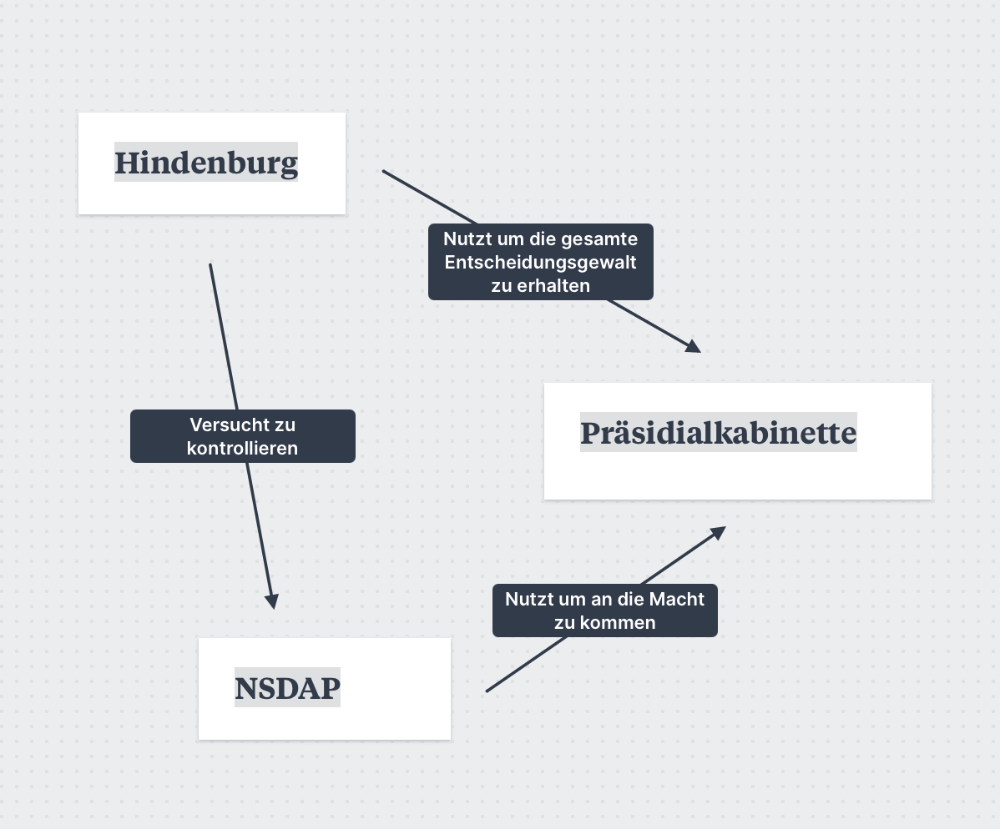

# Anfänge

## Dolchstoßlegende

Behauptung, die deutsche Armee sei im Ersten Weltkrieg "von hinten erdolcht" worden, nicht militärisch besiegt.

### EntstehungNach Kriegsende durch Paul von Hindenburg und Erich Ludendorff verbreitet, um Verantwortung der Obersten Heeresleitung (OHL) für die Niederlage abzuweisen.

### Auslöser

- Waffenstillstands durch die Reichsregierung geschlossen.
- Bevölkerung unvorbereitet auf Niederlage, durch Propaganda an Sieg geglaubt.
- Oberheeresleitung stellt den Krieg als eigentlich gewonnen dar, aber die Reichsregierung habe sie mit dem Waffenstillstand hintergangen.

### Politische Instrumentalisierung

- Hindenburgs Aussage 1919 vor Untersuchungsausschuss: Armee sei durch "Zersetzung" geschwächt worden.
- Schuldzuweisung an Friedensresolution (1917), Munitionsarbeiterstreik (1918), und linke Kräfte.

### Rechte Agitation

- DNVP und NSDAP nutzen Legende zur Hetze gegen SPD, USPD, Liberale und Juden.
- Antisemitische Dimension: "Internationales Judentum" als angeblicher Profiteur der Niederlage.

### Gesellschaftliche Wirkung

- Breite Akzeptanz der Legende in der Bevölkerung, besonders unter Weltkriegsteilnehmern.
- Selbstwertsteigerung durch Glaube an unbesiegte Armee, Verrat durch "vaterlandslose" Gruppen.
- Opfer und Verluste des Kriegs erhalten Sinn durch diese Deutung.

### Bedeutung in der Weimarer Republik

- Dolchstoßlegende zentraler Bestandteil rechter Ideologie.
- Legitimation zur Ablehnung und Bekämpfung der demokratischen Weimarer Regierung.

## Krisenjahr 1923

### Ruhrbesetzung und Ruhrkampf

#### Ursachen

- Wirtschaftliche und soziale Probleme
- Nichtzahlung der Reparationszahlungen

#### Verlauf

- Frankreich und Belgien besetzen das Ruhrgebiet als “produktives Pfand” (sollte auch Geld abwerfen), da das Ruhrgebiet die wirtschaftlich stärkste Region in Deutschland war
  - Sollte die Reparationszahlungen decken
- Regierung und Gewerkschaften rufen zu passivem Widerstand in Form eines Generalstreiks auf (Ruhrkampf)
- Ruhrgebiet wurde teilweise lahmgelegt

#### Folgen

- Bevölkerung und Regierung: Ruhrgebiet musste weiterhin von Deutschland unterstützt werden (Löhne), aber Industrieerträge fallen weg (Doppelbelastung des Staates)
  - Finanzielle Schwierigkeiten und Geldentwertung durch das Drucken von neuem Geld
  - Siehe Hyperinflation
- Bevölkerung und Regierung: Frankreich und Belgien ziehen sich aus dem Ruhrgebiet zurück

### Hyperinflation

#### Ursachen

- Kriegskredite und -anleihen nach dem Ersten Weltkrieg
- Schwache Wirtschaftliche Lage Deutschlands
- Die staatliche Finanzierung des passiven Wiederstandes im Ruhrgebiet
  - Senkt die Wirtschaftsleistung und erhöht die Geldmenge

#### Verlauf

- Entwertung des Geldes mit vorschreitender Zeit
- Rapid und unkontrollierte Geldentwertung
- Realwert des Geldes (das, was nicht draufsteht) fällt unkontrollierbar

#### Folgen

- Mittelschicht: besonders Mittelschicht von den Folgen betroffen
  - Sparvermögen ging verloren
  - Schulden schrumpften zusammen
- Eliten: weniger betroffen als die anderen Bevölkerungsschichten
- Gesamtes Land: Das Währungsversagen brachte Wirtschaft, Staat und Gesellschaft an den Rand des Zusammenbruchs.

### Putschversuche

#### Ursachen

- Unzufriedenheit mit der Regierung
  - Versailler Vertrag
  - Wirtschaftslage
- reaktionstische Bewegungen zurück zum Kaiserreich

#### Verlauf

- 1920 versuchten reichsgesinnte Freikorpseinheiten (Kapp-Lüttwitz-Putsch) die Regierung zu stürzen
  - Scheitern am Widerstand der Ministerialbürokratie und Arbeiterschaft (Generalstreik)
- November 1923 Hitler(-Ludendorff-)Putsch zum ersetzen des Reichskanzlers durch Hitler
  - Wurden von der Landespolizei gehindert, haben aber kaum Strafen erhalten
- Putschversuche auch von Links: Aufstellung der “Proletarischen Hundertschaften” in Sachsen und Thüringen (formal zum Schutz vor rechten Putschversuchen) zur Vorbereitung einer proletarischen Revolution nach sowjetischem Vorbild

#### Folgen

- Regierung: Bayern bildete eine rechtsgerichtete Landesregierung, die gegen republikfeindliche Bestrebungen kaum vorging
- Bevölkerung: Politische Instabilität, generelle Gewalt, Radikalisierung politischer Gruppen, verstärkte Akzeptanz von radikalen Bewegungen

## Novemberrevolution

Die Novemberrevolution in Deutschland begann im November 1918, als Arbeiter und Soldaten gegen das autoritäre Kaiserreich protestierten. Ausgelöst durch das Leid des Ersten Weltkriegs und soziale Notstände, forderten die Menschen das Ende der Monarchie und demokratische Reformen. Durch den Kieler Matrosenaufstand, bei welchem Matrosen die in ein „letztes“ Gefecht geschickt wurden, desertierten, begann die Revolution und ging von Stadt zu Stadt. Die Revolution führte am 9. November 1918 zur Abdankung Kaiser Wilhelms II. und zur 2.-Fachen Ausrufung der Weimarer Republik durch Philipp Scheidemann und durch Karl Liebknecht. In den folgenden Monaten kam es jedoch zu Konflikten zwischen verschiedenen politischen Gruppen, die in Unruhen und teils gewaltsamen Auseinandersetzungen mündeten.

### Theodor Wolff (S. 290 M7) beschreibt die Revolution wie folgend:

- Dynamischer Eindruck
- plötzlicher Machtwechsel
- Bedeutung der Revolution für Wolff wird durch Beschreibung des Machtapparats verdeutlicht
- es handle sich um die größte Revolution, stelle Franz. Revolution in den Schatten

### Zwei Seiten der Revolution (punktuell/militärisch & Massenbewegung)

- S. 290 M8: punktuelle gewaltsame Auseinandersetzung zwischen Regierungstruppen und linken Revolutionären
- S. 290 M9: Massenbewegung
- „Für Frieden, Freiheit und Brot“
- Ende der Monarchie

### Herausforderungen für die provisorische Regierung

#### S. 291 M10

- Kriegsniederlage / Folgen bewältigen (Z. 7)
- Hungersnot (Z. 7)
- Eingliederung der rückkehrenden Soldaten (Z. 8)
- Wirtschaftssystem überarbeiten / stabilisieren (Z. 11)
- Eingriff in Besitzstruktur / Verstaatlichung
- Regierung vor Umstürzen schützen (Z. 13)
- Gewaltexzesse der Freikorps (Z. 18)
  o Freikorps waren die Freiwilligenverbände, die mit der Regierung im Spartakusaufstand und gegen die zweite Münchener Räterepublik gekämpft haben. Dabei haben diese exzessive Gewalt ausgeübt.
- Zögerlichkeit und Unsicherheit, da unerfahren / unerwartet an die Spitze des Staates gekommen (Z. 27)
- Akzeptanz der Regierung schaffen

#### S. 291 M11

- Kriegsniederlage bewältigen (Z. 4)
- politische Neuordnung (Z. 5)
- Zeitdruck (Z. 6)
- Mehrheitsbildung (Z. 22)
- keine exekutive Erfahrung (Z. 33f)
- Wahrnehmung der Republik nach der brutalen Niederschlagung des Spartakusaufstandes (Z. 44ff)

## Parteienlandschaft

Die Weimarer Parteienlandschaft ist von einer starken Diskrepanz zwischen den Zukunftsvorstellungen – sowie Gegenwarts- und Regierungsvorstellungen – der unterschiedlich orientierten Parteien geprägt. Die linken Parteien, wie die SPD, sehen die Zeit als einen Aufbruch in ‚die neue Zeit‘. Dem gegenüber stehen rechte Parteien, wie die DNVP, welche vor einer Revolution und den linken Parteien warnen und sich als Retter vor dem Untergang inszenieren. Zwischen diesen Parteien gibt es keinen Konsens für eine Demokratie.

Ein großer Streitpunkt zum Anfang Weimars war die Frage, ob der Staat eine Räterepublik oder repräsentative Demokratie werden sollte. Dabei kam aber auch bei den rechtsorientierten Parteien der Wunsch nach dem Kaiserreich auf.

### gewünschte Rolle und Aufgaben des Reichspräsidenten nach den Parteien

#### MSPD (Friedrich Ebert)

Die Mehrheitssozialdemokratische Partei Deutschlands (MSPD) hatte während der Entstehung der Weimarer Republik eine klare Vorstellung von der Rolle und den Aufgaben des Reichspräsidenten. Sie sah den Reichspräsidenten als eine Art "Ersatzkaiser," der jedoch durch demokratische Prozesse gewählt und in seiner Macht kontrolliert werden sollte (ähnlich wie eine konstituelle Monarchie). Die MSPD wünschte sich einen Präsidenten, der:

1. Symbol der Einheit und Stabilität ist und durch seine Autorität das Vertrauen der Bevölkerung in die junge Demokratie stärkt.
2. Überparteilich handelt, also nicht direkt in die Parteipolitik eingreift, sondern die gesamte Nation repräsentiert.
3. Wichtige Kompetenzen in Krisenzeiten hat, um im Notfall handlungsfähig zu bleiben und die Republik zu schützen, allerdings unter demokratischen Kontrollmechanismen.
4. Den Parlamentarismus unterstützt, ohne ihn zu dominieren, und eng mit dem Reichstag zusammenarbeitet, um eine demokratische Regierungsweise zu sichern.
   Durch diese Aufgaben wollte die MSPD die Weimarer Republik stabilisieren und das Vertrauen in die neue Staatsform stärken, während der Reichspräsident gleichzeitig ein Sicherheitsnetz für Krisen darstellte.

#### USPD (Hugo Haase)

- Vorwurf, DNVP wolle den Adel wieder installieren
- Der Staat muss eine Spitze haben
- Gesamtministerium als Spitze der Regierung (anklang an dem Rätesystem)
  - Kontrolliert von der Volksvertretung
- Keine Autoritätsperson aus dem Adel / Rückbesinnung auf die Monarchie
- Souveränität liege im Volk
- Bekenntnis zur sozialistischen Demokratie
  DNVP (Albrecht Philipp)
- Bekenntnis zur ‚Führerfigur‘
- Ablehnung einer parteipolitischen geprägten Demokratie
- Persönliche Spitze notwendig
  - Repräsentation nach innen und außen
- Viel Macht für den Reichspräsidenten
- Autoritätsbedürfnis des Volks
- Reichspräsident ist direkt vom gesamten Volk gewählt
- Personen, die über den Parteien stehen, um eine Mehrheit zu schaffen

#### DDP (Bruno Ablaß)

- Frühe Verwurzlung einer ‚Führervorstellung‘
- Bekenntnis zu einer Souveränität des Volkes
- Verhinderung einer erneuten Monarchie
- Reichspräsident als Kontrollorgan neben dem Reichstag
- Reichspräsident soll die Menschen lenken / erziehen und nicht von den Massen geleitet werden
- neuer starker demokratischer Präsident, um nicht zur Monarchie zurückzufallen
- Reichspräsident steht über parteipolitischen Streitigkeiten
- Skepsis hinsichtlich parlamentarisch demokratischer Entscheidungsfindung

### Wahlverhalten in Weimar

- Stimmverluste für die Weimarer Koalition (SPD, Zentrum, DDP)
- Stimmgewinne für die Antidemokratischen Parteien (DNVP, KPD, später NSDAP)
- Vielfältiges Parteienspektrum
  - Zahlreiche Parteien vertraten unterschiedliche politische Richtungen (Sozialdemokraten, Kommunisten, Liberale, Konservative, Nationalisten).
- Komplexe Mehrheitsverhältnisse ab den 1920ern
  - Fragmentierung: Keine Partei erlangte dauerhaft die absolute Mehrheit, was zu häufig wechselnden Koalitionen führte.
- Starke Polarisierung und Radikalisierung ab 1930
  - Wachsende Unterstützung für extrem linke (KPD) und rechte Parteien (NSDAP) in Zeiten von Krisen.
- Regionale Unterschiede
  - Sozialdemokraten (SPD) stark in Industriegebieten, konservative und rechte Parteien in ländlichen Gebieten.
- Wahlen als Protest
  - Insbesondere in den 1930er Jahren wurden die Wahlen oft als Ausdruck des Protests gegen die Wirtschaftskrise und das politische System genutzt.
    Wahlverhalten bei den republikfreundlichen und feindlichen Parteien

1. bereits 1920 hatten die republikfreundlichen Parteien 48,2%
2. in den Goldenen 20ern legen die republikfreundlichen Parteien wieder zu
3. Nach der Weltwirtschaftskriese legen die republikfeindlichen Parteien zu
4. 1930: (DNVP+NSDAP = 25,3%) + (KPD = 13,1%) = 1/3 republikfeindlich
5. 1932 NSDAP allein 37,3% => mehr als die Hälfte republikfeindlich

#### Wahlverhalten nach Parteien

#### SPD (Sozialdemokratische Partei Deutschlands)

- Stärkste Partei in der Anfangszeit der Republik.
- Unterstützung durch Arbeiterklasse und Gewerkschaften.
- Befürwortete die demokratische Republik und sozialreformerische Maßnahmen.
- Verlor in den 1930er Jahren an Bedeutung, da sie zwischen extremen Lagern stand und wenig radikale Lösungen anbot.

#### KPD (Kommunistische Partei Deutschlands)

- Radikale linke Partei.
- Unterstützung hauptsächlich aus Arbeiterklassen und urbanen Gebieten.
- Ziel: Revolution und Errichtung einer Räterepublik nach sowjetischem Vorbild.
- Profitierte von der Unzufriedenheit mit der SPD und der Wirtschaftskrise, gewann in den 1930er Jahren an Bedeutung.

#### NSDAP (Nationalsozialistische Deutsche Arbeiterpartei)

- Rechtsradikale Partei mit starker nationalistischer und antisemitischer Ideologie.
- In den frühen 1920er Jahren unbedeutend, nach der Weltwirtschaftskrise ab 1930 starkes Wachstum.
- Unterstützung von Mittelschicht, Landwirten, Arbeiterklasse (besonders Arbeitslose) und zunehmend auch der Oberschicht.
- Profitierte von der Wirtschaftskrise, Enttäuschung über die Demokratie und dem Versprechen von nationaler Wiederherstellung.

#### Zentrum (Zentrumspartei)

- Katholische Partei mit starker Unterstützung durch die katholische Bevölkerung, besonders im Westen und Süden Deutschlands.
- Verteidigte die Interessen der katholischen Kirche und trat für einen Ausgleich zwischen verschiedenen sozialen Schichten ein.
- Spielte eine wichtige Rolle in vielen Koalitionsregierungen der Weimarer Republik.

#### DDP (Deutsche Demokratische Partei)

- Liberale Partei mit einer Basis im Bildungsbürgertum und intellektuellen Milieus.
- Setzte sich für eine demokratische und liberale Ordnung ein, aber verlor im Laufe der Jahre zunehmend an Unterstützung.

#### DVP (Deutsche Volkspartei)

- Konservative, wirtschaftsliberale Partei, angeführt von Gustav Stresemann.
- Unterstützt von der Wirtschaftselite, Unternehmern und wohlhabenden Bürgern.
- Nach anfänglicher Opposition zur Republik entwickelte sie sich zu einer Partei, die die Republik stützte, solange sie wirtschaftliche Interessen wahren konnte.

#### DNVP (Deutschnationale Volkspartei)

- Rechtskonservative, monarchistische Partei.
- Starke Unterstützung durch Adel, Großgrundbesitzer, Militär und Teile des Großbürgertums.
- Gegner der Weimarer Republik, strebte nach einer Rückkehr zur Monarchie und einer autoritären Ordnung.
- Ab den späten 1920er Jahren näherte sie sich der NSDAP an.

#### BVP (Bayerische Volkspartei)

- Regionalpartei in Bayern, katholisch und konservativ, ähnlich dem Zentrum, aber mit stärkerem Fokus auf föderalistischen Interessen.
- Stark in Bayern verankert, lehnte die zentralistische Tendenz der Weimarer Republik ab.

#### USPD (Unabhängige Sozialdemokratische Partei Deutschlands)

- Linkssozialistische Abspaltung von der SPD.
- Forderte eine radikalere sozialistische Politik, insbesondere während des Ersten Weltkriegs.
- Fusionierte teilweise später mit der KPD, verlor aber nach der Spaltung viel an Bedeutung.

## Versailler Vertrag

### Inhalt

- **Kriegsschuld**: Deutschland wurde im „Kriegsschuldartikel“ (Artikel 231) die alleinige Schuld am Ersten Weltkrieg zugeschrieben.
- **Reparationen**: Deutschland musste hohe Reparationszahlungen an die Alliierten leisten. Die genaue Summe wurde später auf 132 Milliarden Goldmark festgelegt.
- Gebietsverluste:
  - **Abtretung von Gebieten an Nachbarstaaten**: Elsass-Lothringen an Frankreich, Westpreußen und Posen an Polen, Eupen-Malmedy an Belgien.
  - Verlust der Kolonien, die an die Siegermächte unter Völkerbundmandat gingen.
  - Entmilitarisierte Zonen, wie das Rheinland.
- Militärische Beschränkungen:
  - Begrenzung der deutschen Armee auf 100.000 Mann und Verbot der Wehrpflicht.
  - Verbot schwerer Waffen wie Panzer, U-Boote und Luftstreitkräfte.
  - Entmilitarisierung des Rheinlandes.
- **Völkerbund**: Der Völkerbund wurde als Friedensorganisation gegründet, aber Deutschland wurde zunächst der Beitritt verwehrt.

### Folgen

#### Wirtschaftliche Krisen:

- **Hyperinflation (1923)**: Durch die hohen Reparationszahlungen und die Belastung der Wirtschaft kam es zu einer enormen Geldentwertung. Die Inflation führte dazu, dass Ersparnisse der Mittelschicht vernichtet wurden, was das Vertrauen in die Republik weiter schwächte.
- **Abhängigkeit von Auslandskrediten**: Um die Reparationen zu zahlen, nahm Deutschland hohe Kredite aus dem Ausland, besonders von den USA, auf. Die Weltwirtschaftskrise 1929 führte jedoch dazu, dass diese Kredite plötzlich abgezogen wurden, was Deutschland in eine schwere Wirtschaftskrise stürzte und die Massenarbeitslosigkeit massiv ansteigen ließ.

#### Politische Instabilität:

- **Legitimationsverlust der Weimarer Republik**: Der Versailler Vertrag wurde als "Schandfrieden" empfunden, und viele Deutsche gaben der Weimarer Regierung die Schuld dafür, dass sie diesen Vertrag unterzeichnet hatte. Das schwächte das Vertrauen in die junge Demokratie.
- **Stärkung extremistischer Parteien**: Die starke Unzufriedenheit in der Bevölkerung mit dem Versailler Vertrag und den wirtschaftlichen Problemen führte dazu, dass sowohl linke (z.B. Kommunisten) als auch rechte (z.B. Nationalsozialisten) Parteien Zulauf erhielten. Besonders die NSDAP konnte sich als "Anti-Versailles-Partei" profilieren und gewann stark an Unterstützung.
- **Revanchismus**: Viele Deutsche hatten das Ziel, die Gebietsverluste rückgängig zu machen und die "Schmach von Versailles" zu überwinden. Nationalistische und militaristische Gruppen nutzten dieses Gefühl der Erniedrigung und propagierten einen aggressiven Revisionismus.
- **Feindseligkeit gegenüber anderen Staaten**: Der Kriegsschuldartikel und die hohen Reparationen führten zu einer tiefen Ablehnung der Siegermächte, vor allem gegenüber Frankreich. Diese Spannungen machten eine langfristige friedliche Zusammenarbeit in Europa schwierig und verstärkten das Gefühl der Isolation.

#### Gesellschaftliche Spaltung:

- **Vertrauensverlust in die Demokratie**: Durch die Auswirkungen des Versailler Vertrags verlor die Bevölkerung zunehmend das Vertrauen in die demokratischen Institutionen. Viele sahen in einer autoritären oder sogar diktatorischen Führung eine bessere Alternative, was die Gesellschaft stark spaltete.
- **Verarmung und soziale Unruhen**: Die wirtschaftliche Notlage führte zu massiver Verarmung, besonders der Mittelschicht, die sich durch Inflation und Arbeitslosigkeit stark geschwächt fühlte. Diese sozialen Spannungen entluden sich in Streiks, Aufständen und Straßenkämpfen.
- **Eingeschränkte Verteidigungsfähigkeit**: Die Begrenzung auf eine 100.000-Mann-Armee und die Abrüstung führten dazu, dass Deutschland militärisch stark eingeschränkt war. Dies wurde als Demütigung empfunden und spornte viele an, das militärische Potenzial heimlich aufzubauen, was den Weg für eine spätere Wiederaufrüstung bereitete.

### 14-Punkte-Plan (US-Präsident Woodrow Wilson (1918))

- **Offene Diplomatie**: Abschaffung geheimer Bündnisse und transparente internationale Verhandlungen.
- **Freiheit der Schifffahrt**: Freie Navigation auf den Meeren in Friedens- und Kriegszeiten (außer in gesperrten Gewässern).
- **Freier Handel**: Abbau von Handelshemmnissen und Förderung des freien Handels zwischen den Nationen.
- **Abrüstung**: Reduktion der nationalen Rüstungen auf ein Maß, das die innere Sicherheit gewährleistet.
- **Koloniale Ansprüche**: Gerechte Behandlung der kolonialen Ansprüche mit Rücksicht auf die Interessen der Kolonialvölker.
- **Räumung russischen Territoriums**: Unabhängigkeit Russlands und Unterstützung seines Wiederaufbaus.
- **Wiederherstellung Belgiens**: Räumung und Wiederherstellung des neutralen Belgiens.
- **Rückgabe Elsass-Lothringens**: Rückgabe des von Deutschland annektierten Elsass-Lothringen an Frankreich.
- **Grenzkorrekturen in Italien**: Anpassung der italienischen Grenzen entlang ethnischer Linien.
- **Unabhängigkeit für die Völker Österreich-Ungarns**: Selbstbestimmungsrecht der Völker innerhalb der Donaumonarchie.
- **Neugestaltung des Balkans**: Unabhängigkeit für Rumänien, Serbien und Montenegro und Sicherstellung eines Zugangs zum Meer für Serbien.
- **Autonomie des Osmanischen Reiches**: Souveränität der Türkei und Selbstbestimmung für andere Nationalitäten unter osmanischer Herrschaft.
- **Unabhängiges Polen**: Gründung eines unabhängigen Polens mit Zugang zur Ostsee.
- **Völkerbund**: Schaffung eines internationalen Bundes zur Sicherung des Friedens und zur Vermeidung zukünftiger Konflikte.

#### Intention

Die Intention hinter Woodrow Wilsons „Vierzehn Punkten“ bestand darin, nach dem Ersten Weltkrieg eine friedliche und stabile Weltordnung zu schaffen. Wilson wollte durch seine Vorschläge die Ursachen für internationale Konflikte beseitigen und eine Grundlage für einen dauerhaften Frieden legen.

- **Friedenssicherung und Vermeidung zukünftiger Konflikte**: Wilson strebte einen gerechten und dauerhaften Frieden an, der das Misstrauen und die Rivalität zwischen den Nationen beseitigen sollte. Offene Diplomatie und weniger Militarismus waren für ihn dabei entscheidend.
- **Stärkung nationaler Selbstbestimmung**: Wilson unterstützte das Recht der Völker auf Selbstbestimmung, was sich in seinem Wunsch nach nationaler Autonomie für unterdrückte Völker (z.B. in Osteuropa und dem Osmanischen Reich) zeigte.
- **Freier Handel und Wirtschaftsbeziehungen**: Durch die Beseitigung wirtschaftlicher Barrieren und die Förderung des freien Handels sollten nationale Interessenkonflikte abgebaut und wirtschaftliche Zusammenarbeit gefördert werden.
- **Förderung von Demokratie und Freiheit**: Wilson wollte, dass alle Nationen unabhängig und demokratisch organisiert sind. Die Einbeziehung der Interessen der Bevölkerungen in kolonialen Gebieten zielte auf eine gerechtere Weltordnung ab.
- **Gründung eines Völkerbunds (League of Nations)**: Mit einem internationalen Zusammenschluss sollten Konflikte friedlich beigelegt und die territoriale Integrität und politische Unabhängigkeit aller Staaten gesichert werden.

Die „Vierzehn Punkte“ sollten somit eine neue Ära der internationalen Zusammenarbeit und Stabilität einläuten, in der Machtpolitik durch gerechte und offene diplomatische Prozesse ersetzt würde.

#### Umsetzung im Versailler Vertrag

Die „Vierzehn Punkte“ von Präsident Wilson haben nur teilweise funktioniert. Zwar wurden einige seiner Ideen in den Friedensvertrag von Versailles aufgenommen, aber viele seiner Ziele wurden letztlich nicht umgesetzt oder waren nur von kurzer Wirkung. Hier ist eine Übersicht über die Ergebnisse und Herausforderungen der Umsetzung:

- **Teilerfolg bei der Gründung des Völkerbunds**: Wilsons Idee eines internationalen Bündnisses zur Friedenssicherung führte zur Gründung des Völkerbunds, was einen wichtigen Schritt darstellte. Jedoch trat die USA selbst dem Völkerbund nicht bei, da der US-Senat den Vertrag ablehnte. Ohne die USA und mit eingeschränkten Durchsetzungsmechanismen blieb der Völkerbund schwach und konnte große Konflikte wie den Zweiten Weltkrieg nicht verhindern.
- **Grenzregelungen und nationale Selbstbestimmung**: Die Idee der nationalen Selbstbestimmung wurde teils berücksichtigt, z.B. bei der Schaffung neuer Staaten wie Polen, Tschechoslowakei und Jugoslawien. Dennoch wurden viele Grenzentscheidungen willkürlich getroffen und brachten Spannungen, da sie ethnische Gruppen trennten oder in neue Staaten einordneten, was künftige Konflikte beförderte.
- **Ungerechter Friedensvertrag für Deutschland**: Wilsons Ziel eines „gerechten Friedens“ wurde durch den harten Vertrag von Versailles nicht erreicht. Statt einer Versöhnungspolitik wurde Deutschland die alleinige Kriegsschuld gegeben und es musste hohe Reparationen zahlen, was in Deutschland Ressentiments schürte, und die Wirtschaft schwächte. Dies trug erheblich zu den politischen und wirtschaftlichen Krisen bei, die später zum Aufstieg der Nationalsozialisten führten.
- **Wirtschaftliche Zusammenarbeit und freie Schifffahrt**: Einige seiner Ideen zur Förderung des Freihandels und der freien Schifffahrt wurden nicht konsequent umgesetzt. Die Wirtschaftskrisen der 1920er und 1930er Jahre führten zu einem Erstarken von Protektionismus, was Spannungen zwischen den Nationen weiter verschärfte.
- **Fortbestehen kolonialer Strukturen**: Wilsons Punkt zur fairen Regelung kolonialer Ansprüche wurde weitgehend ignoriert. Die Kolonialmächte Frankreich und Großbritannien behielten ihre Gebiete oder schufen Mandate im Nahen Osten, was die Spannungen in diesen Regionen verstärkte.

Insgesamt waren die „Vierzehn Punkte“ idealistisch und zielten auf eine gerechtere, friedlichere Welt ab. Viele seiner Vorschläge waren jedoch ihrer Zeit voraus und stießen auf Widerstand seitens der europäischen Verbündeten, die härtere Bedingungen durchsetzen wollten. Die teilweise und ungleichmäßige Umsetzung von Wilsons Ideen trug letztlich dazu bei, dass die angestrebte Friedensordnung zerbrach und die Welt nur zwei Jahrzehnte später in den Zweiten Weltkrieg schlitterte.

## Weimarer Reichsverfassung

### Funktion und Beziehung des Reichspräsidenten, Reichskanzlers und Reichstags

Siehe Buch, S. 288 M5 Schaubild

#### Reichspräsident

- wird direkt (vom Volk) gewählt (Art. 41)
  - steht über den Parteien und Reichstag
- hat die Oberbefehlsmacht über das Militär (Art. 47)
- kann den Reichstag auflösen (Art. 25)
- Notverordnung für den Einsatz bewaffneter Kräfte Innerlandes (Art. 48)
  - mit der Notverordnung soll Ordnung und Sicherheit wiederhergestellt werden und Länder zum Mitwirken zwingen
  - kann sofort vom Reichspräsident einberufen werden und muss, sobald der Reichstag dies entscheidet, wieder entkräftet werden
  - Kann den Reichstag entlassen und so die Notverordnung in Kraft lassen
- ernennt und entlässt den Reichskanzler und Reichsminister (Art. 53)
- Funktion als starke Autoritätsfigur „über dem Staat“ steht und von niemand anderem kontrolliert werden kann
- für 7 Jahre gewählt und kann wiedergewählt werden (Art. 41)
- Oft benannt als ‚Ersatzkaiser‘
- Kann mithilfe von Volksentscheiden direkt Einfluss auf die Gesetzgebung nehmen
- Stärkstes Regierungsorgan (z. B. Notverordnung)

#### Reichsregierung

- vom Reichspräsidenten ernannt und entlassen
- Spitze der Exekutive des Staats
- Reichsregierung muss sich an Gesetze des Reichstags und Anordnungen des Reichspräsidenten halten
- Gesetze müssen von Reichsregierung gegengezeichnet werden
- die Reichsregierung ist das schwächste Regierungsorgan (Kann von Reichstag und Reichspräsident aufgelöst werden)

#### Reichstag

- kann die Reichsregierung auflösen (Misstrauensvotum) (Art. 54)
- Aufgabe: Kontrolle der Regierung und Gesetzgebung (Art. 68)
- kann den Reichspräsidenten nicht abschaffen oder kontrollieren
- Mit zweidrittel Mehrheit kann der Reichstag ein Volksentscheid einberufen, ob der Reichspräsident geeignet ist (abgeschafft werden soll)

### Artikel der Weimarer Verfassung

| **Artikel (Weimarer Verfassung)** | **Inhalt**                                                                                                                                                                                                               | **Bezug zu Grundgesetz**                                                                                                                                                                                                                                                                        |
| --------------------------------- | ------------------------------------------------------------------------------------------------------------------------------------------------------------------------------------------------------------------------ | ----------------------------------------------------------------------------------------------------------------------------------------------------------------------------------------------------------------------------------------------------------------------------------------------- |
| **Art. 1**                        | Die Staatsgewalt gehe vom Volk aus und das Deutsche Reich ist eine Republik.                                                                                                                                             | **GG 20:** In Deutschland geht die Staatsgewalt auch vom Volk aus, ist aber nicht als Republik definiert, sondern als sozialer, demokratischer Bundesstaat.                                                                                                                                     |
| **Art. 20**                       | Der Reichstag besteht aus den Abgeordneten des deutschen Volkes.                                                                                                                                                         | **GG 38:** Der Bundestag besteht aus Vertretern des ganzen Volkes. Abgeordnete sind nur an ihr Gewissen gebunden. Bürger ab 18 wählen diese in allgemeiner, unmittelbarer, freier, gleicher und geheimer Wahl.                                                                                  |
| **Art. 21**                       | Abgeordnete sind nur an ihr Gewissen gebunden. => Sie müssen sich nicht an ihre Versprechen und Worte halten.                                                                                                            | **GG 38:** Auch hier sind Abgeordnete nur an ihr Gewissen gebunden.                                                                                                                                                                                                                             |
| **Art. 22**                       | Ab 20 dürfen Männer und Frauen in allgemeiner, gleicher, unmittelbarer und geheimer Wahl die Abgeordneten wählen.                                                                                                        | **GG 38:** Wahlberechtigung ab 18 Jahren mit denselben Kriterien.                                                                                                                                                                                                                               |
| **Art. 25**                       | Der Reichstag kann vom Reichspräsidenten aufgelöst werden. => Neuwahlen                                                                                                                                                  | **GG 68:** Der Bundespräsident kann den Bundestag nur nach einer gescheiterten Vertrauensfrage des Bundeskanzlers auf dessen Empfehlung auflösen.                                                                                                                                               |
| **Art. 41**                       | Der Reichspräsident wird direkt vom Volk gewählt. => direkte Demokratie bei der Wahl des Reichspräsidenten.                                                                                                              | **GG 54:** Der Bundespräsident wird von der Bundesversammlung (Bundestag und Bundesrat kombiniert) gewählt.                                                                                                                                                                                     |
| **Art. 48**                       | Wenn ein Land sich nicht an seine Pflichten hält, kann der Reichspräsident die Grundrechte außer Kraft setzen und mit militärischer Gewalt eingreifen. => Notverordnung (wirkt widersprüchlich und missbrauchsanfällig). | **GG 19:** In keinem Fall darf ein Grundrecht in seinem Wesensgehalt angetastet werden. Keine Notverordnung vorgesehen.                                                                                                                                                                         |
| **Art. 50**                       | Der Reichspräsident benötigt für Anordnungen an die Wehrmacht die Zustimmung des Reichskanzlers oder zuständigen Reichsministers.                                                                                        | **GG 58:** Der Bundespräsident benötigt die Gegenzeichnung durch den Bundeskanzler oder zuständigen Minister.  **GG 65a:** Der Verteidigungsminister hat die Befehlsgewalt über die Bundeswehr.  **GG 115b:** Im Verteidigungsfall hat der Bundeskanzler die Befehls- und Kommandogewalt. |
| **Art. 53**                       | Der Reichspräsident ernennt und entlässt die Reichsminister und den Reichskanzler.                                                                                                                                       | **GG 64:** Die Bundesminister werden auf Vorschlag des Bundeskanzlers vom Bundespräsidenten ernannt und entlassen.  **GG 63 Abs. 1:** Der Bundeskanzler wird auf Vorschlag des Bundespräsidenten vom Bundestag gewählt.                                                                      |
| **Art. 54**                       | Der Reichstag kann dem Reichskanzler und den Reichsministern das Vertrauen entziehen, wodurch diese zurücktreten müssen.                                                                                                 | **GG 67:** Der Bundestag kann dem Bundeskanzler das Misstrauen nur aussprechen, indem er mit der Mehrheit seiner Mitglieder einen Nachfolger wählt und den Bundespräsidenten ersucht, den bisherigen Kanzler zu entlassen.                                                                      |
| **Art. 73**                       | Ein Volksentscheid wird durchgeführt, wenn der Reichspräsident dies entscheidet, keine Zweidrittelmehrheit vorliegt, und min. 5% oder 10% der Bevölkerung dies fordert.                                                  | **GG 29 Abs. 6:** Volksentscheide finden nur noch bei der Reorganisation von Ländern statt.                                                                                                                                                                                                     |
| **Art. 109**                      | Vor dem Gesetz sind alle gleich! (alle Deutschen)                                                                                                                                                                        | **GG 3:** Gleichheit vor dem Gesetz (alle Menschen).                                                                                                                                                                                                                                            |
| **Art. 114**                      | Die Freiheit einer Person ist unverletzlich. Eine Einschränkung oder Entziehung ist nur durch ein Gesetz möglich.                                                                                                        | **GG 2:** Jeder hat das Recht auf Freiheit; Einschränkungen sind nur durch Gesetze erlaubt.                                                                                                                                                                                                     |
| **Art. 165**                      | Arbeiter und Angestellte müssen gleichberechtigt mit Unternehmern an Lohn- und Arbeitsbedingungen sowie der wirtschaftlichen Entwicklung mitwirken.                                                                      | In dieser Form nicht mehr vorhanden.  **GG 9 Abs. 3:** Das Recht auf Gewerkschaften ist jedoch garantiert.                                                                                                                                                                                   |

### Verfassungskontroversen

- Macht des Reichspräsidenten: Durch Artikel 48 (Notverordnung) und Artikel 25 (Auflösung des Reichstags) konnte der Präsident im Notfall praktisch diktatorische Vollmachten übernehmen, was die Demokratie gefährdete.
- Instabile Mehrheiten: Das Verhältniswahlsystem führte zu vielen Parteien im Reichstag, wodurch stabile Regierungen schwer bildbar waren.
- Schwache Verfassungsverteidigung: Es gab keine effektiven Schutzmechanismen gegen verfassungsfeindliche Parteien und extremistische Kräfte.
- Geringe demokratische Akzeptanz: Viele Bürger und Eliten standen der Verfassung ablehnend gegenüber, was die politische Stabilität untergrub.

# Niedergang der Demokratie Weimars

### wirtschaftliche Lage

- Deutschland befand sich in einer schwierigen wirtschaftlichen Lage
- Arbeitslosigkeit war sehr hoch und Lebensqualität war nicht gut
- Unzufriedenheit machte sich in der Bevölkerung breit
- Weitere Infos: [Weltwirtschaftskriese](#weltwirtschaftskriese)

## gesellschaftliche Rahmenbedingungen zum Ende der Demokratie

- geringe Demokratieakzeptanz in der Bevölkerung
- Kontinuität alter Eliten
- gesellschaftliche Polarisierung und Radikalisierung
- strukturelle Schwächen in dem Weimarer Staatssystems

Weitere Infos: [Strukturprobleme](#kontinuität-alter-eliten--strukturprobleme)

### politische Radikalisierung

- Spaltung der politischen Landschaft, ideologische Gräben und Interessenskonflikte erschwerten eine langfristige Zusammenarbeit der Parteien.
- Wahl Hindenburgs (1925) stärkte **republikfeindliche Kräfte** und schwächte die demokratische Mehrheit.
- Häufige **Regierungswechsel** und kurze Amtszeiten **verhinderten politische Kontinuität**.
  - Die „Große Koalition“ zerbrach 1930, da keine Einigung über die Erhöhung der Beiträge zur Arbeitslosenversicherung erzielt werden konnte.
- KPD und NSDAP **radikalisieren** sich immer weiter
- Mit der Berufung Heinrich Brünings (Zentrumspartei) zum Reichskanzler und der Durchsetzung von Gesetzesvorhaben mittels Artikel 48 der Reichsverfassung (Notverordnungen) begann die Umgehung des Reichstags und die Zeit der **Präsidialkabinette**.

## Präsidialkabinette

**Minderheitsregierungen**, die ihrer gesetzgebenden Funktion über den Reichspräsidenten nachkommen

- über die Notverordnung möglich
- übergeht den demokratischen Prozess
- gibt dem Reichspräsidenten fast unbegrenzte Macht

### Funktionsweise der Präsidialkabinette

### Reichsverfassung Art. 25

Der Reichstag kann vom Reichspräsidenten **aufgelöst** werden. => Neuwahlen

### Reichsverfassung Art. 48

Wenn ein Land sich nicht an seine Pflichten hält, kann der Reichspräsident die Grundrechte außer Kraft setzen und mit militärischer Gewalt eingreifen. => **Notverordnung** (wirkt widersprüchlich und missbrauchsanfällig).

## Gerhard Schulz: "[An] diesem Tag [18. Juli 1930] begann die permanente Durchbrechung des Verfassungssystems durch die Diktaturgewalt des Reichspräsidenten."

Das Zitat von Gerhard Schulz beschreibt einen kritischen Moment in der Geschichte der Weimarer Republik. Am 18. Juli 1930 begann laut Schulz die dauerhafte Verletzung des Verfassungssystems durch die diktatorische Macht des Reichspräsidenten. Dies bedeutet, dass an diesem Tag eine Phase eingeleitet wurde, in der die demokratischen Prinzipien und die Verfassung der Weimarer Republik zunehmend durch autoritäre Maßnahmen des Reichspräsidenten untergraben wurden. Das wurde über die **Präsidialkabinette** ermöglicht und durchgesetzt.

## Akzeptanz der Präsidialkabinette in der Bevölkerung

- frustration der Bevölkerung mit der wirtschaftlichen und politischen Lage
- Akzeptanz der Präsidialkabinette gegeben, da diese die Regierung handelsfähig machten.
  - das zeigt sich an der **wiederholten Wahl von Hindenburg** 1932, wo Präsidialkabinette schon tagesordnung waren

## NSDAP und Präsidialkabinette

- die NSDAP ist ursprünglich über die **Präsidialkabinette** an die Macht gekommen
- die hohen Wählerstimmen zeigen die **Akzeptanz** der NSDAP und ihrer **Demokratiefeindlichkeit**

## Der Aufstieg der Nationalsozialisten

### Machtzunahme der NSDAP

- 1929 erregte die NSDAP größere öffentliche Aufmerksamkeit durch ihre Kampagne gegen den **Young-Plan**, bei der sie mit der DNVP zusammenarbeitete.
- Seid 1930 steigt die gesellschaftliche Akzeptanz der NSDAP wie an den Wahlergebnissen zu sehen ist
  - 1928: 2,6%
  - 1930: 18,3%
  - 1932 Wahl 1: 37,4% / Wahl 2: 33,1%
  - 1933: 43,9%
- die NSDAP diente als Auffangbecken für unzufriedene Wähler

### Abhängigkeit der Regierung von Notverordnungen seit 1930

- Demokratische Institutionen wurden geschwächt, Vertrauen in die Demokratie nahm ab
- Aufgrund fehlender parlamentarischer Mehrheiten regierte die Regierung Brünings über **Präsidialkabinette**

## Strategie der NSDAP

### Nutzung der Schwächen des Systems in der Weimarer Republik

> Quelle: S. 365 M17 Joseph Goebbels (NSDAP) über "Legalität" im "Angriff" (1928)

Goebbels erklärt, wie die NSDAP das Vorhaben hat die Weimarer Republik von innen mit ihren eigenen Mitteln zu unterwandern.

1. Die NSDAP lässt sich zur Wahl aufstellen
2. sie bekommt staatliche finanzielle Unterstützung
3. sie wird gewählt
4. sie hebelt die Weimarer Verfassung von innen aus

### Radikalisierung der Bevölkerung

- Über das Ansprechen der Unzufriedenheit der Bevölkerung mit einfachen Erklärungen und Lösungen und dem schieben der Schuld auf u. a. die Juden und Sozialdemokraten.
  - [Dolchstoßlegende](#dolchstoßlegende)
  - [der "Schandfrieden" von Versaille](#versailler-vertrag)

## Verhältnis Hindenburg und Hitler

### Hindenburgs Sicht auf Hitler

- Abneigung gegenüber Hitler als "Emporkömmling" und "böhmischen Gefreiten"
- Skepsis gegenüber Hitlers radikalen Ideen und der NSDAP

### Politischer Pragmatismus

- Papen überzeugt Hindenburg, Hitler zum Reichskanzler zu ernennen
  - "In sechs Wochen haben wir Hitler so in die Ecke gedrängt, dass er quietscht." ~Franz von Papen, Ende Januar 1933
  - Versuch, Hitler über die Ernennung zum Reichskanzler zu kontrollieren
  - Hoffnung, Hitler führt einen gemäßigteren Kurs, nach Verantwortung als Kanzler
- Hindenburg ernennt Hitler zum Reichskanzler am 30. Januar 1933

### Machtverschiebung

- Hitler gewann schnell an Einfluss (durch Hindenburgs Krankheit)
- Hindenburg blieb formal Staatsoberhaupt bis zu seinem Tod 1934

### Hitlers Machtergreifung

- Nach Hindenburgs Tod vereinte Hitler die Ämter des Reichspräsidenten und Reichskanzlers
- Etablierung der NS-Diktatur

## Ereignisgeschichte ab 1932

- **Wahlkampf zur Reichspräsidentenwahl 1932:**

  - Hitler verliert die Wahl, profitiert jedoch von gesteigerter öffentlicher Aufmerksamkeit
  - NSDAP unterstützt Hindenburg nach der Wahl, trotz Gegnerschaft

- **Juni 1932:**

  - **Franz von Papen** wird Reichskanzler und bildet ein Kabinett ohne parlamentarische Mehrheit
  - Ziel von Papen und Hindenburg: **NSDAP einbinden und kontrollieren**
  - Reichstag wird aufgelöst, erneute Neuwahlen im Juli 1932

- **Juli 1932:**

  - NSDAP wird mit 37,3 % stärkste Partei, erhält jedoch **keine absolute Mehrheit**
  - Franz von Papen bietet Hitler Vizekanzlerposten an, Hitler lehnt ab und fordert den Kanzlerposten

- **November 1932:**

  - NSDAP verliert Stimmenanteile (33,1 %), bleibt aber **stärkste Partei**
  - Verschlechterung der **wirtschaftlichen Lage und Unzufriedenheit** in der Bevölkerung

- **Januar 1933:**

  - Franz von Papen überredet Hindenburg, Hitler zum Reichskanzler zu ernennen, mit dem Plan, Hitler durch konservative Minister zu kontrollieren
  - Am 30. Januar 1933 wird **Hitler zum Reichskanzler** ernannt, wodurch die Machtergreifung der NSDAP offiziell eingeleitet wird
  - Regierung Hitler stützt sich auf eine Koalition mit DNVP, die eine Mehrheit im Reichstag sichern soll

- **März 1933**

  - **5. März:** Bei der Reichstagswahl im März 1933 erreichte die NSDAP 43,9 Prozent und damit **fast eine absolute Mehrheit**
  - **21. März: Tag von Potsdam:** Eröffnungszeremonie des Reichstags unter Adolf Hitler als Reichskanzler
  - **24. März: Ermächtigungsgesetz:** Aufhebung der Gewaltenteilung zwischen Exekutive und Legislative

## Machtsicherung

- Das Ermächtigungsgesetz ermöglichte der Reichsregierung ohne Zustimmung des Reichstags Gesetze zu erlassen. Das machte die Regierung - und somit Hitler - essenziell zu einer Diktatur ohne Gewaltenteilung.
- Die NSDAP musste nicht nur von Außen ihre Macht absichern, sondern auch innerparteilich für Einheit sorgen.

# Vergangenheit vs. Geschichte und Historikerurteile

## Beziehung von Vergangenheit und Geschichte

Bei Vergangenheit handelt es sich um das konkrete Geschehene, während Geschichte eine uneindeutige, analytische, perspektivisch geprägte Konstruktion der Vergangenheit ist.

## M2: Eberhard Kolb / Dirk Schumann

sehr **komplexes Ursachengeflecht** aus vielen Faktoren:

- institutionelle Rahmenbedingungen
  - verfassungsmäßige Rechte und Möglichkeiten des Reichspräsidenten
- ökonomische Entwicklung / Auswirkungen
  - politische und gesellschaftliche Machtverhältnisse
- Besonderheiten der politischen Kultur
- Veränderungen im sozialen Gefüge
  - Umschichtungen im "Mittelstand"
- ideologische Faktoren
  - autoritäre Traditionen
  - extremer Nationalismus
- massenpsychologische Elemente
  - Erfolgschancen massensuggestiver Propaganda
- die Rolle einzelner Persönlichkeiten
  - Hindenburg
  - Papen
  - Hitler

## M1: Hans-Ulrich Thamer

### gemeinsame Rahmenbedingungen in Europa

- erster Weltkrieg und Auswirkungen auf Politik und gesellschaft

### Was benötigt der Faschismus als erfolgreiche Massenbewegung?

- das Politische System kann keine stabile Mehrheit finden
- starke Linksbewegungen -> Verunsicherung der Mitte
- Belastung der nationalen Identität aufgrund der Kriegsniederlage und Friedensregelung ("Schandfrieden" von Versaille)

## Vergleich der Historikerurteile

- Unterschiedliche Forschungsschwerpunkte (M2: Weimarer Republik (Spezifisch) / M1: Europafokus & Nationalsozialismus(Allgemein))
  - M2: Blick auf die gesamte Zeit der Weimarer Republik / M1: Blick auf Ende der Weimarer Republik

# Weltwirtschaftskriese

- Börsencrash in den USA

## Folgen

- **Rezession** / Firmenpleite
  - sinkende Löhne
  - sinkende Kaufkraft
- Industrieproduktion fällt drastisch
  - Besonders die USA getroffen
  - Deutschland auch stark getroffen
  - Gesamteuropa, Großbritannien und Frankreich am geringsten betroffen
- Steigende **Arbeitslosigkeit**
  - **Schlechte Lebensbedingungen**
    - u. a. wegen einer schlechteren Versorgung mit Konsumgütern
  - Unzufriedenheit / Radikalisierung / **politischer Unmut**
  - Höhere Belastung für den Staat
- steigende Staatsausgaben
  - wachsende Staatsverschuldung
- **Radikalisierung** der politischen Landschaft
  - KPD, DNVP und NSDAP hat mehr als 58% der Stimmen
- **Destabilisierung** der politischen Lage

## Gründe

- Starke Abhängigkeit an die USA wegen Krediten
  - Die Gläubiger forderten diese Kredite während der Krise zurück.
- **Exportabhängigkeit** Deutschlands
- Versailler Vertrag und wirtschaftliche Lage führen zu einem **"Schuldenkarussell"**
- **Spekulationsblase** in den USA

## Reichskanzler Brüning zur Weltwirtschaftskriese

- Glaube, dass sich die deutsche Wirtschaft erholen kann
- Verhinderung der Inflation um jeden Preis (Deflationspolitik)
- Sparmaßnahmen zur Bewältigung der Krise
- Offenheit und Ehrlichkeit sowie internationale Kooperation
- Offenheit und Ehrlichkeit führten zu gesenkten Reparationszahlungen

## Bank für internationalen Zahlungsausgleich über die deutsche Situation

- Lohn und Preise sinken (deflatorische Maßnahmen)
- hohe Erwerbslosigkeit
- Kernproblem: Kapitalbedarf (Kredite) aus dem Auslands
- Viel Kapital floss wegen den Reparationszahlungen gleich wieder ab
  - infolge dessen empfindlich für Störungen des Finanzmarkts
- Deutschlands Lage schadet dem Weltmarkt
  - andere Staaten sollten Deutschland helfen

## Von der Wirtschafts- zur Staatskrise in Deutschland

### Wirtschaftliche Probleme

- Sinkende Wirtschaftsleistung und **steigende Arbeitslosenzahlen** führten zu wachsender sozialer und wirtschaftlicher Unsicherheit.
- Dies erhöhte den Druck auf die regierende „Große Koalition“ (SPD, DDP, Zentrum, DVP, BVP), die aufgrund **fehlender Kompromissbereitschaft** im Parlament **immer weniger handlungsfähig** war.

### Politische Destabilisierung

- Die Auseinandersetzungen um den „Young-Plan“ wurden von rechtsnationalen Kreisen genutzt, um die Regierung, insbesondere Reichskanzler Hermann Müller (SPD), zu attackieren.
- **Antidemokratische und antisemitische Propaganda** wurde verstärkt, u. a. durch Pressekonzerne und Gruppen wie die NSDAP.

### Gewalt und Polarisierung

- Es kam zu **regelmäßigen Saal- und Straßenschlachten** zwischen den Schlägertruppen der Parteien.
- Die zunehmende **Radikalisierung und Polarisierung** schwächte das politische System weiter.

### Krise der parlamentarischen Demokratie

- Die „Große Koalition“ zerbrach 1930, da keine Einigung über die Erhöhung der Beiträge zur Arbeitslosenversicherung erzielt werden konnte.
- Mit der Berufung Heinrich Brünings (Zentrumspartei) zum Reichskanzler und der Durchsetzung von Gesetzesvorhaben mittels Artikel 48 der Reichsverfassung (Notverordnungen) begann die Umgehung des Reichstags.

### Auflösung des Reichstags und Präsidialkabinett

- Nach der Ablehnung von Brünings Sparmaßnahmen durch den Reichstag wurde der Reichstag aufgelöst.
- Es folgte die Etablierung eines **Präsidialkabinetts**, das de facto die **parlamentarische Demokratie aushöhlte** und eine neue Verfassungswirklichkeit schuf.

# Die Goldenen 20er

## Wesentliche Elemente, die die Epoche der „Goldenen Zwanziger“ prägen

### Wirtschaft / Gesellschaft / Technik

- **Wirtschaftsaufschwung:**
  - Wirtschaftlich stabilere Jahren nach 1924
  - Modernisierung und Aufschwung nicht auf Deutschland beschränkt
  - Anstieg von Massenkonsumgütern wie Autos
  - Trotz Wirtschaftsaufschwung hohe Arbeitslosigkeit und Armut
- **Technischer und sozialer Fortschritt:**
  - Massenmedien wie Kino und Radio traten erstmals auf
  - Zeitungen erlebten einen großen Zuwachs
  - Die Regierung setzte sich für sozialen Fortschritt in Form von z. B. einer Arbeitslosenversicherung.
- **Vernetzung der Bevölkerung:**
  - Über Massenmedien wie den Rundfunk können mehr Personen in kürzerer Zeit erreicht werden
  - Verbreitung des Telefons
- **Urbanisierung und Beschleunigung des Lebens:**
  - Viele Menschen zogen in die Städte, um Arbeit zu finden
  - Durch den technischen Fortschritt und die Urbanisierung beschleunigte sich das Leben und wurde hektischer.
- **Zentralität der Künstler:**
  - Künstler waren keine Außenseiter mehr.
  - Prägende Figuren in Diskussionen und Themengeber.
  - Unterstützung der Künste und Förderung der Avantgarde durch die Regierung
  - verfassungsbedingte Rechte wie Meinungs- und Kunstfreiheit
- **Freizeitbeschäftigungen:**
  - Kino oder Radio als Freizeitbeschäftigung
  - Zugang zu Freizeitbeschäftigungen spalten die Gesellschaft weiter in Reich und Arm, sowie in Land und Stadt
- **Kritik an der jungen Demokratie:**
  - Teile der Künstler und Intellektuellen übten heftige Kritik an der Weimarer Republik
  - Einfluss konservativer, antirepublikanischer und kulturpessimistischer Ideen
- **Rebellion gegen wilhelminisches Bürgertum:**
  - Aufschwung nach den Erfahrungen des Ersten Weltkriegs
  - Ermöglicht durch die Meinungs- und Kunstfreiheit der Weimarer Verfassung
- **Frauen in den “Goldenen Zwanziger”:**
  - Vor der Verfassung gleichberechtigt
  - Praktisch oft vom Mann abhängig
- **Internationale Parallelen:**
  - **USA:** „Roaring Twenties“
  - **Frankreich:** „Années Folles“

### Kultur

- **Kultur / Kulturelle Relevanz:**
  - Bruch mit ästhetischen Überzeugungen der Vergangenheit
  - Breitere Bevölkerungsschichten zeigten Interesse an Kunst
  - Deutsche Künstler erhielten internationale Aufmerksamkeit
  - Umgekehrt großes Interesse an US-amerikanischen Entwicklungen
- **Abwendung vom Expressionismus (ab 1922/23):**
  - Ende der Suche nach völlig neuen Kunstformen.
  - Fokus auf unsentimentalen Pragmatismus und sachliche Auseinandersetzung mit der Wirklichkeit
- **Neue Sachlichkeit:**
  - Begriff geprägt vom Kunsthistoriker Gustav Friedrich Hartlaub.
  - Gemeinsame Merkmale zahlreicher Kunststile, trotz individueller Unterschiede.
- **Entwicklung der Fotografie:**
  - Etablierung als eigenständige Kunstform.
  - Hervorragend geeignet, die Aspekte der Industriewelt zu erfassen.
- **Literarische Neuerungen:**
  - **Einführung neuer Ausdrucksformen:**
    - Reportage, Reisebericht, kurze Notizen.
  - Präzise und einfühlsame Darstellung von Industrie, Technik und Großstadtleben.

## Epochenbezeichnung „Goldene Zwanziger“

- Bezieht sich auf die künstlerische Kreativität und Vielfalt der Zeit
- Mehr als ein Mythos, zeigt die Hinwendung zur Moderne
- Steht für außergewöhnliche schöpferische Kraft und Experimentierfreude
- “Gold” steht für Wohlstand und wirtschaftlicher Aufschwung

## die „zwei Kulturen“ der Weimarer Republik

- **Kulturvielfalt in der Weimarer Zeit:**
  - Künstlerische Avantgarde nicht allein bestimmend.
  - Traditionelle Kunstrichtungen und hergebrachte Formensprache weiterhin einflussreich.
- **Kulturelle / Räumliche Trennlinien:** Strikte Trennung zwischen Arbeiterkultur und bürgerlicher Hochkultur.

Polarisierung der Kulturszene in zwei Lager:

### progressive Kräfte (Avantgarde)

**_Optimistisch und Fortschrittsorientiert_**

- Aufbruchstimmung nach Erstem Weltkrieg und Kaiserreich
- Hoffnung auf eine friedliche, bessere Zukunft
- Expressionismus -> Neue Sachlichkeit
- experimentell, innovativ
- Begeisterung für Modernisierung, Fortschritt, Urbanisierung, Technisierung
- Rationalität, Funktionalität
- Radikaler, Kunst öfter für Einfluss

### konservative Kräfte

**_Kulturpessimismus und Zivilisationskritik_**

- Nationalistische und revisionistische Einstellungen, basierend auf Kriegsopfern
- Trauer um die verlorene Monarchie / Nähe zu Kaiserreich
- Widerstand gegen moderne Kunst und Avantgarde
- Ablehnung von Großstadtleben, moderner Kultur und Zivilisation
- traditionelle Kultur / 'reine' deutsche Kultur
- Angst vor "kulturellem Zerfall"
  - "entartete Kunst"
- Ablehnung der Technisierung

## kulturbejahende und kulturpessimistische Positionen

|                       | kulturbejahend                                                                                                                                                                                                                                                                                                                                                                                                                                                                                                     | kulturpessimistisch                                                                                                                                                                                                                                                                                                                                                                                                                                                                                                                                                                                                                                                                                                                                                                                                                                                                                      | neutral                                                                                                                                                                                                                                                                                                                                             |
| --------------------- | ------------------------------------------------------------------------------------------------------------------------------------------------------------------------------------------------------------------------------------------------------------------------------------------------------------------------------------------------------------------------------------------------------------------------------------------------------------------------------------------------------------------ | -------------------------------------------------------------------------------------------------------------------------------------------------------------------------------------------------------------------------------------------------------------------------------------------------------------------------------------------------------------------------------------------------------------------------------------------------------------------------------------------------------------------------------------------------------------------------------------------------------------------------------------------------------------------------------------------------------------------------------------------------------------------------------------------------------------------------------------------------------------------------------------------------------- | --------------------------------------------------------------------------------------------------------------------------------------------------------------------------------------------------------------------------------------------------------------------------------------------------------------------------------------------------- |
| Kunstrichtungen       | „Der Expressionismus gab der seelischen Anspannung der Menschen nach der Katastrophe des verlorenen Krieges und ihrer Zerrissenheit zwischen extremen, höchst widersprüchlichen Gefühlen künstlerischen Ausdruck.“ (M8 Literatur)                                                                                                                                                                                                                                                                                  | „Man steht hier vor dem Lebensschicksal eines Volkes, dem ein großer Teil des nordischen Blutes anvertraut war, vor der Frage seines Lebens oder Vergehens.“ (M10); "Wir brauchen dringender den je den Rückblick auf die seelische Feinnervigkeit der deutschen Landschaft, um uns Kultureinflüssen hier in Berlin zu erwehren, die unser Volk nicht weiterbringen, sondern in der Volkspflege und in der Volkskultur zurückwerfen." (M18)                                                                                                                                                                                                                                                                                                                                                                                                                                                              |                                                                                                                                                                                                                                                                                                                                                     |
| soziale Veränderungen | „Das Vaterland verfällt. […] Wir werden Weltbürger.“ (M7); „Wir leben schneller und daher länger.“ (M7)                                                                                                                                                                                                                                                                                                                                                                                                            | "[Jenen] erschien das sich rasch amerikanisierende Berlin als ein modernes Babylon, das es zu "säubern" galt" (M15)                                                                                                                                                                                                                                                                                                                                                                                                                                                                                                                                                                                                                                                                                                                                                                                      | "[Berlin] war eine Stadt der Superlative" (M15)                                                                                                                                                                                                                                                                                                     |
| Gesellschaft          | "[Das Volk verlangt] nach Zerstreuung, Freude und Erhebung" (M16)                                                                                                                                                                                                                                                                                                                                                                                                                                                  | "Hedonismus, also eine ganz im Hier und Jetzt angesiedelte Grundhaltung des Strebens nach innerweltlicher Glückseligkeit um ihrer selbst Willen." (M21 Literatur)                                                                                                                                                                                                                                                                                                                                                                                                                                                                                                                                                                                                                                                                                                                                        |                                                                                                                                                                                                                                                                                                                                                     |
| Politik               | "Sie soll dem sozialen Ausgleich dienen und die Klüfte zwischen den Gesellschaftsschichten überbrücken helfen." (M16)                                                                                                                                                                                                                                                                                                                                                                                              |                                                                                                                                                                                                                                                                                                                                                                                                                                                                                                                                                                                                                                                                                                                                                                                                                                                                                                          |                                                                                                                                                                                                                                                                                                                                                     |
| Tradition             | "Dieser Tanz reinigt die Tradition vom Staub der Jahrzehnte" (M11)                                                                                                                                                                                                                                                                                                                                                                                                                                                 |                                                                                                                                                                                                                                                                                                                                                                                                                                                                                                                                                                                                                                                                                                                                                                                                                                                                                                          |                                                                                                                                                                                                                                                                                                                                                     |
| Technik               | "Alles [...] vermag der Rundfunk leichter als die Presse [...]" (M19); "Der Rückgang des Dienstpersonals in vielen bürgerlichen Haushalten nach dem Krieg verstärkte das Interesse an der Technik." (M19); "Die Elektrizität eröffnete im privaten Bereich erstmals unbegrenzte Technisierungsmöglichkeiten, während bis dahin Mechanisierungspläne, die einen künstlichen Antrieb voraussetzten, mit kollektivistischen Ideen verknüpft und durch diese in ihrer Verbreitung gehemmt waren." (M19 Literatur)(M16) |                                                                                                                                                                                                                                                                                                                                                                                                                                                                                                                                                                                                                                                                                                                                                                                                                                                                                                          |                                                                                                                                                                                                                                                                                                                                                     |
| Konsum                |                                                                                                                                                                                                                                                                                                                                                                                                                                                                                                                    | "Gleichzeitig schritt die Kommerzialisierung der Kultur voran." (M21)                                                                                                                                                                                                                                                                                                                                                                                                                                                                                                                                                                                                                                                                                                                                                                                                                                    | "Das Angebot an Konsumgütern wuchs[] und es prägte sich eine Konsumkultur aus [...]" (M21)                                                                                                                                                                                                                                                          |
| Frauenbild            |                                                                                                                                                                                                                                                                                                                                                                                                                                                                                                                    | "Für dieses traditionellen Frauen interessierten sich in der Weimarer Republik weder Medien noch Sozialpolitik" (M22); "Die Abwesenheit der Frau während des Tages, die hastige Erledigung der Hausarbeit in den Abendstunden und die in der Regel bestehende Überanstrengung der Frau bedeutet für die Familie immer eine Einbuße an Gemütlichkeit" (M24); "Die Hausarbeit muss notgedrungen flüchtiger gemacht werden, was für die Familie oft ein Minus an Ernährung bedeutet." (M24); "Die berühmte weibliche Anpassungsfähigkeit wird bei einer solchen Entwicklung meist etwas zurückgehen." (M24); "War ein Zwiespalt der heutigen Frau so stark angegangen, dass er keine Freude mehr an der Zeugung von Menschen hatte, die ein klarer Lebensweg versagt bleibt oder [...] denen die Zivilisation besonders große Steine und Kreuzwege in die einstige Naturbestimmung geschmuggelt hat." (M25) | "Markenzeichen der modernen Frau, die den Gleichberechtigungsgrundsatz der Weimarer Verfassung ernst nahm und ihren Platz in Beruf und Öffentlichkeit selbstbewusst ausfüllte." (M22); "[Es] setzte sich in der Öffentlichkeit der Eindruck fest, dass Frauen stärker als vor dem Ersten Weltkrieg in die objektive Kultur einbezogen seien." (M22) |

## Leben in der Großstadt (Berlin) in den Goldenen 20ern

- moderne Freizeitbeschäftigungen
  - Spaltung der Gesellschaft durch ungleiche Möglichkeiten
- Konsum / Massenkonsum
- ausländische Einflüsse (besonders USA) / Bruch mit Traditionen
- beschleunigtes Leben
  - Medien
  - Straßen- / U-Bahn
- Technisierung / Demokratisierung
- Massenmedien
  - große Reichweite, schnell

## Merkmale für Berlin als Kulturmetropole

- junge Weltstadt
  - weniger Vorbelastung durch Traditionen und alte Kultur
  - Möglichkeit für Neues
- Internationalität
  - Kulturaustausch
  - große jüdische Bevölkerung / Gemeinschaft mit internationalen Beziehungen
- viele Einwohner
- Technischer Fortschritt
  - U-Bahn
  - Filmindustrie
  - Massenmedien
- Geografische Lage in Europa
- Zentrum avantgardistischer Strömungen
- lebhafte Kulturszene: Expressionismus, Neue Sachlichkeit

## Einfluss des Staates auf den Rundfunk

- Staat erkennt die Bedeutung / den Einfluss des Rundfunks an
- Verhindern des Einflusses durch andere politische Gruppen
- kein gewinnorientiertes Interesse
- Rundfunk soll zivilisierten Diskurs politischer Meinungen bieten und nicht (wie Zeitungen) parteigebunden
- Identitätsstiftende Funktion durch gemeinsames Massenmedium
- Interesse als Medium der Volksbildung und Unterhaltung
- (Vergleich zu Funktionen von Medien für den politischen Prozess (PoWi))

# Gustav Stresemann und Außenpolitik

## Zeitstrahl

<https://igsff-bs.de/iserv/file/-/Groups/Klasse%2013.4/Geschichte/3.%20Halbjahr_Weimarer%20Republik/Stresemann/Au%C3%9Fenpolitische%20Ereignisse%20Zeitstrahl.pdf?show=true>

## Biografie und politische Überzeugungen Stresemanns bis 1919

### Biografie und politische Überzeugungen Stresemanns bis 1919

#### Frühere Jahre und Studienzeit

- Nach Studium bis 1897: Beitritt in die Reformburschenschaft „Neogermania“
  - Positive Einstellung gegenüber dem liberalen Erbe von 1848 (Revolutionsversuch)
  - Bekenntnis zum nationalen Machtstaat
  - Keine Zugehörigkeit zu antisemitischen oder traditionellen Gruppen

#### Wirtschaftliches Engagement und politische Anfänge

- Wirtschaftslobbyist: Rechtsbeistand des „Verbands sächsischer Industrieller“ (1902–1908)
- Einsatz für:
  - Sozialen Fortschritt ohne Klassenkampf
  - Sozialistisch orientierten Liberalismus
- Heirat seiner Frau mit jüdischen Wurzeln (1903)
- Beitritt zur Nationalliberalen Partei (1903)

#### Politische Karriere bis 1914

- Mitglied des Reichstags ab 1907: Jüngster Abgeordneter
  - Konflikte mit dem rechten Flügel der Nationalliberalen Partei wegen seiner sozialgesetzlichen Reformideen (1907–1912)
- Politische Ziele:
  - Abschaffung des Dreiklassenwahlrechts
  - Parlamentarisierung des politischen Systems
  - Weltwirtschaftliche Orientierung und deutsche Weltpolitik (die verstärkt auf Flotten-, Wehr- und Kolonialpolitik setzt)

#### Zeit während des Ersten Weltkriegs

- Reichstagsmitglied (1914–1918): Unterstützung der Annexionspolitik
  - Überzeugung, dass Deutschland einen Verteidigungskrieg führt
  - England als Hauptfeind: Befürwortung des uneingeschränkten U-Boot-Kriegs
- Parteivorsitz der Nationalliberalen Partei (1917)

#### Politischer Wandel nach 1918

- Unterstützung der „Siegfriedenspolitik“ bis zur Kriegsniederlage:
  - Bleibt Monarchist, akzeptiert jedoch die Republik und sympathisiert mit einem parlamentarischen System
- Mitgründer der rechtsliberalen Deutschen Volkspartei (DVP) (22. November 1918)
  - Konzentration auf die Interessen des Bürgertums und der Wirtschaft
- Mitglied der verfassungsgebenden Nationalversammlung (1919)

## Charakterisierung der Politik der DVP und Stresemanns Rolle

- **Anfangs konservative Ausrichtung:**
  Die Deutsche Volkspartei (DVP) unter Stresemanns Führung positionierte sich in den frühen Jahren der Weimarer Republik konservativ, um bürgerliche Wähler der rechten Mitte anzusprechen. Diese Strategie stand im Gegensatz zum dezidiert linksliberalen und republikanischen Kurs der Deutschen Demokratischen Partei (DDP).
- **Ablehnung der Weimarer Verfassung (1919):**
  - Die DVP lehnte die Verfassung ab, nicht primär wegen ihrer demokratischen Inhalte, sondern wegen des Bruchs mit der Monarchie und der Zurückweisung der DVP durch die Parteien der Mitte.
  - Stresemann hielt sich während der Verfassungsdebatten auffallend zurück und konzentrierte sich stattdessen auf den Aufbau der Parteistrukturen.
- **Abgrenzung von rechtskonservativen Kräften:**
  Ab 1920 distanzierte sich Stresemann, auch wenn von der DDP erst anders verdächtigt, klar von der rechtskonservativen Deutschnationalen Volkspartei (DNVP), die eine "verantwortungslose Opposition" gegen die Republik betrieb. Dies zeigte eine zunehmende Annäherung an die Prinzipien der demokratischen Ordnung.

## Stresemanns Ansichten zum politischen System - 'Krise des Parlamentarismus'

- **Fehlentwicklungen des Systems:** Das parlamentarische System in Deutschland funktioniere nicht effizient und erfülle seine Aufgaben nicht wie vorgesehen.
- **Mangelndes Verantwortungsbewusstsein:** Das Parlament versage bei der Krisenbewältigung und bilde keinen Konsens für notwendige Entscheidungen.

### Reformansätze und Rolle des Reichspräsidenten

- **Stärkung des Reichspräsidenten:** Erweiterung seiner Rechte, um die Regierungsbildung zu vereinfachen und gegebenenfalls gegen das Parlament durchzusetzen. Der Reichspräsident und der Reichskanzler sollten auch unabhängig von Fraktionen handeln können.
- **Kabinettsbildung und Führung:** Der Reichspräsident könnte durch ein Machtwort Krisen lösen und die Regierungsbildung den Fraktionen entziehen.

### Ablehnung der Diktatur und Appell an Verantwortung

- Stresemann lehnt diktatorische Systeme ab und betont die Gefahren solcher Regime. Er appelliert an die Verantwortung des Reichspräsidenten statt einer parlamentarischen Kontrolle.
- **Überwindung des Parteigeistes:** Parteien sollten den nationalen Interessen dienen, und bei Versagen der Parteien sollten verantwortungsbewusste Persönlichkeiten die Führung übernehmen.

### Fazit

Stresemann sieht die „Krise des Parlamentarismus“ durch fehlende Konsensbildung, die die Regierung lähmt. Als Lösung strebt er eine Stärkung des Reichspräsidenten an, was eine Monarchisierung der Republik widerspiegeln könnte.

## Außenpolitik

### Was sind die Ziele?

- **Versailler Vertrag revidieren**
  - Einstellung der Reparationszahlungen
  - Korrektur der Ostgrenzen
  - Schutz der Deutschen, die durch den Versailler Vertrag in anderen Ländern leben
- **Deutschland erneut als gleichberechtigte souveräne europäische Großmacht etablieren**
- **Anschluss von Deutsch-Österreich**

### Umsetzung

- Verzicht auf Krieg, diplomatische Beziehungen aufbauen  
  → Deutschlands Wirtschaft als Hauptmittel der Außenpolitik einsetzen
- Durch gemeinsame Interessen (Weltwirtschaft stabilisieren und stärken) freundschaftlich politische Basis schaffen
- Wirtschaftliche Beziehungen als Fundament für Erreichung der Ziele  
  → Forderung stellen können
- Rheinland diplomatisch durch Verträge schützen
- Völkerbund (Internationaler Friedensbund) beitreten, um den Stellenwert zu erhöhen
- Trickreich große Entscheidungen umgehen, um späteren Handlungsspielraum nicht einzugrenzen

### Was unterscheidet Stresemanns Politik von anderen?

- **„Nationale Revisionspolitik als internationale Versöhnungspolitik“** - (Karl Dietrich Erdmann)
- **„Nationale Realpolitik“** - Ihm gelang es, die politische Wirklichkeit zu erkennen und seine Politik danach auszurichten bzw. die Notwendigkeit bestimmter politischer Maßnahmen zu erkennen.
  - z.B. Wirtschaft statt Waffen
  - Kleinschrittiger, langfristig ausgelegter Plan, statt überhasteten Umbrüchen

### Revision des Versailler Vertrags durch Versöhnungspolitik?

#### „Erfolge“ der Versöhnungspolitik

- Ende der Besetzung des Rheinlands "Young-Plan" (1930)
- Ende der Reparationszahlungen (1932)
- Militärische Gleichberechtigung (1932)

#### „Versäumnisse“ der Versöhnungspolitik:

- Nachhaltigkeit - Beständigkeit nach seinem Tod nicht gegeben

### Wie wirkt die Außenpolitik nach innen?

#### Parteipolitisch

- Unterstützung durch DVP (Stresemann als Vorsitzender)
- Die DNVP lehnte Stresemanns Außenpolitik ab, da die Annäherungspolitik gegen die nationalistischen Ansichten ging.
- Die MSPD und Zentrumspartei unterstützten Stresemanns Außenpolitik, um sich der Weltgemeinschaft anzunähern.

#### Gesellschaftlich

- **Arbeiter:**  
  Da Stresemann wirtschaftliche Sicherheit priorisierte und sich die Wirtschaft während seiner Zeit als Außenminister stabilisierte, waren die Arbeiter tendenziell positiv gestimmt, auch wenn sie mit seinen politischen Überzeugungen nicht vollkommen übereinstimmten.

- **Bürgertum:**  
  Das Bürgertum war neutral bis positiv gegenüber den außenpolitischen Entscheidungen, da das wirtschaftliche Wachstum vorteilhaft war und Stresemanns Fokus auf die deutsche Wirtschaft als außenpolitische Kraft gut ankam.

- **Militär:**  
  Die Außenpolitik berief sich auf wirtschaftliche Stärke, daher war die Zustimmung eher ablehnend.  
  Die Annäherung an die Sowjetunion ermöglichte verstärkte Waffentests und Übungen, die am Versailler Vertrag vorbei gingen, was eher zu Zustimmung führen könnte.

## Stresemann als Repräsentant seiner Zeit?

### Stresemann als 'Vernunftrepublikaner'

1. **Frühere Ablehnung der Republik:**
   Zu Beginn seiner politischen Karriere stand Stresemann der Weimarer Republik skeptisch gegenüber. Er und seine Partei, die Deutsche Volkspartei (DVP), lehnten die Verfassung von 1919 ab, da sie den endgültigen Übergang von der Monarchie zur Republik markierte. Diese Haltung widersprach einerseits der republikanischen Staatsform und setzte ihn in Opposition zur Weimarer Verfassung. Auch die Weimarer Republik selbst wurde von Stresemann als Übergangsregierung in einer schwierigen Zeit gesehen, was seine Ablehnung der republikanischen Grundordnung unterstreicht.

2. **Der Wandel hin zur Akzeptanz der Republik**  
   Ab etwa 1920 änderte sich Stresemanns Haltung. Dieser Wandel war nicht von einer tiefen ideologischen Überzeugung, sondern von pragmatischen Überlegungen geprägt. Stresemann erkannte die Notwendigkeit, mit der bestehenden politischen Ordnung zusammenzuarbeiten, um die politische und wirtschaftliche Stabilität des Landes zu sichern. Er setzte sich ab diesem Zeitpunkt öffentlich für die Weimarer Republik ein, ohne sie jedoch aus tiefer Überzeugung zu befürworten. Diese pragmatische Akzeptanz der Republik könnte Stresemann als 'Vernunftrepublikaner' qualifizieren, da er die republikanische Staatsform als das „kleinere Übel“ in einer Zeit politischer und sozialer Unsicherheit betrachtete.

3. **Stresemanns Haltung zum Kapp-Putsch 1920**  
   Ein weiteres Argument für die Bezeichnung Stresemanns als 'Vernunftrepublikaner' ergibt sich aus seiner Haltung während des Kapp-Putsches 1920. Als dieser versuchte, die Weimarer Republik gewaltsam zu stürzen, verurteilte Stresemann den Putsch eindeutig und betonte die Notwendigkeit, die verfassungsmäßige Ordnung zu wahren. Diese klare Ablehnung von reaktionären, antidemokratischen Kräften zeigt, dass er trotz seiner monarchistischen Neigungen bereit war, sich für die bestehende republikanische Ordnung einzusetzen, um die politische Stabilität des Landes zu sichern.

4. **Langsame Entwicklung und pragmatische Einsicht**  
   Stresemanns Akzeptanz der Weimarer Republik war daher weniger von einer ideologischen Zustimmung als vielmehr von einer pragmatischen Einsicht geprägt, dass die Republik als politisches System die bestmögliche Lösung für Deutschland darstellte. In diesem Sinne zeigt sich Stresemann als pragmatischer Politiker, der die Weimarer Republik als notwendige Grundlage für die Bewältigung der deutschen Nachkriegskrise ansah.

5. **Politisches Wirkten in der Weimarer Republik:**
   Als Reichskanzler (1923) und später als Außenminister (1923 - 1929) setzte sich Stresemann aktiv für die Stabilisierung der Republik ein. Seine Politik war geprägt von der Vernunft und dem Bemühen um internationale Zusammenarbeit.

6. **Keine vollständige Identifikation mit der Republik**  
   Es ist jedoch wichtig zu betonen, dass Stresemann nie vollständig mit der Weimarer Republik identifizierte. Er blieb bis zu seinem Tod monarchistisch orientiert und strebte eine Rückkehr zu monarchischen Strukturen an, wenn auch nicht mit Gewalt. Insofern könnte man auch argumentieren, dass Stresemann ein „halb“ Vernunftrepublikaner war, der zwar die Weimarer Verfassung akzeptierte, aber immer eine Rückkehr zu einer monarchischen Ordnung als langfristiges Ziel hatte.

7. **Kontakt zu konservativen Eliten:**
   Stresemann blieb in Kontakt mit konservativen und monarchistischen Kreisen und versuchte, deren Interessen in die Republik einzubinden. Dies könnte den Eindruck erwecken, dass er sich nicht vollständig mit den demokratischen Werten identifizierte.

#### Fazit:

Stresemann kann als 'Vernunftrepublikaner' bezeichnet werden, da er die Weimarer Republik aus pragmatischen Gründen akzeptierte und verteidigte. Seine Haltung war jedoch nie völlig von ideologischer Übereinstimmung mit der republikanischen Staatsform geprägt, sondern eher von einer Einsicht in die Notwendigkeit einer funktionierenden staatlichen Ordnung. Stresemann zeigte sich bereit, die Republik zu unterstützen, um den politischen und sozialen Frieden zu wahren, jedoch ohne sich vollständig mit der republikanischen Idee zu identifizieren.

### Kritik an der Verklärung von Stresemann

Zusammenfassung der Kritik Karl Heinrich Pohls über seine mögliche Verklärung Stresemanns:

- Karl Heinrich Pohl kritisiert, dass die Erinnerungskultur um Gustav Stresemann zu einseitig als positives Bild ausgerichtet sei. Es sei angemessener, seine Ambivalenz, die sowohl sein Leben als auch seine Politik prägte, zu betonen.
- Stresemann war ursprünglich ein Vertreter des Kaiserreichs und der monarchistischen Tradition. Nach deren Zusammenbruch akzeptierte er die Republik nicht aus innerer Überzeugung, sondern als pragmatischer Demokrat.
- Diese Ambivalenz von Stresemann macht ihn zu einer viel treffenden Symbolfigur der Instabilität und Zwiespältigkeit der Weimarer Republik.

### Politische Leistungen von Stresemann

1. **Internationale Anerkennung Deutschlands**: Stresemann trug zur Wiederherstellung der internationalen Position Deutschlands bei und integrierte es als gleichberechtigten Partner in internationale Konferenzen und Abkommen.
2. **Europäische Verständigung**: Er setzte sich für friedliche Zusammenarbeit in Europa ein, besonders durch Verhandlungen mit Frankreich und anderen Staaten.
3. **Erfolge in schwierigen Zeiten**: Trotz politischer und wirtschaftlicher Krisen erzielte Stresemann Erfolge.

### Politische Verfehlungen von Stresemann

1. **Fehlende Stabilität**: Nach seinem Tod wurde kritisiert, dass seine Erfolge nicht ausreichten, um die innenpolitische und wirtschaftliche Stabilität Deutschlands langfristig zu sichern.
2. **Kompromisse**: Stresemanns Außenpolitik wurde teils als unzureichend angesehen, da nicht alle Probleme gelöst wurden.

### Stresemann als Europäischer Verständigungspolitiker oder Nationaler Machtpolitiker?

Stresemann kann sowohl als europäischer Verständigungspolitiker als auch als nationaler Machtpolitiker gesehen werden:

**Europäischer Verständigungspolitiker:**

1. Stresemann setzte auf europäische Verständigung, um die internationalen Beziehungen zu stabilisieren.
2. Er integrierte Deutschland wieder in internationale Verhandlungen, was auf Kooperation hinweist.
3. Besonders seine Versöhnung mit Frankreich zeigt seine Ausrichtung auf Frieden und Zusammenarbeit.

**Nationaler Machtpolitiker:**

1. Stresemann förderte Deutschlands Interessen durch Diplomatie, was als Stärkung nationaler Macht interpretiert werden kann.
2. Seine Bemühungen zur politischen und wirtschaftlichen Stabilisierung Deutschlands zielen auf eine Wiederherstellung nationaler Stärke.

# Rationalisierung und Technisierung am Beispiel des Haushalts

- Viele sich wiederholende Tätigkeiten, daher große Fortschritte durch modernere Methoden
- "Kraftersparnis" und "Gefühlsgewinn"
- Verwissenschaftlichung des Haushalts:
  - **Technisierung** (Einsatz technischer Geräte)
  - **Rationalisierung** (Wirtschaftlichkeit im Sinne von Zeit- und Materialersparnis; Entlastung)
- Elektrifizierung der einzelnen privaten Haushalte
- Widerstand gegen Elektrifizierung in einigen Städten
  - Konkurrenz zwischen Gas und Elektrizität
  - teilweise Verbot der Werbung für den Elektroherd, um die Kontrolle nicht zu verlieren
  - Wasserkraftreiche Länder wie die Schweiz und Norwegen als Vorreiter der elektrischen Küche in Europa
- Rückgang des Dienstpersonals nach dem Krieg verstärkte Interesse an Technik im Haushalt
- Es wurden auch Geräte entwickelt, die Handarbeit im Haushalt erleichterten (Elektrifizierung hinkte in Deutschland hinterher)
- Großes Thema in Deutschland: Sparsamkeit
- Nicht jeder konnte von der Rationalisierung profitieren (eher für wohlhabende Familien vorbehalten)

# Stabilisierung Weimars 1924-1929

## Stabilisierung des demokratischen Systems vs. Stabilisierung der Entwicklungen

Stabilisierung der Weimarer Republik kann als eine Stabilisierung des demokratischen Systems oder als eine Stabilisierung der Prozesse und Entwicklungen gesehen werden. Beispielsweise stabilisierten sich die Wahlergebnisse der rechten Parteien. Im Folgenden wird auf die Stabilisierung des demokratischen Systems und die Lage in der Weimarer Republik eingegangen.

### Politisches System

#### Pro:

- Keine bürgerkriegsähnlichen Zustände oder Umsturzversuche nach der frühen Phase.
- Demokratie funktionierte; Regierungswechsel verliefen friedlich und institutionell geregelt.
- Weimarer Koalition (SPD, Zentrum, Liberale) hielt bis 1932 und ermöglichte zeitweise regierungsfähige Mehrheiten: pro-demokratische Mehrheit
  o Zentrumspartei als stabilisierende Kraft in Koalitionen.
- Weiterhin geringe Resilienz gegen politische Angriffe und Krisen

#### Kontra:

- Spaltung der politischen Landschaft, ideologische Gräben und Interessenskonflikte erschwerten eine langfristige Zusammenarbeit der Parteien.
- Häufige Regierungswechsel und kurze Amtszeiten verhinderten politische Kontinuität.
- Wahl Hindenburgs (1925) stärkte republikfeindliche Kräfte und schwächte die demokratische Mehrheit.

### Wirtschaftliche Entwicklung

#### Pro:

- Einführung der Rentenmark (1923) beendete die Hyperinflation und stabilisierte die Währung.
- Wandel hin zu einer modernen Volkswirtschaft mit stärkeren Anteilen von Industrie und Dienstleistungen.

#### Kontra:

- Internationale Wettbewerbsfähigkeit blieb gering; strukturelle Schwächen der Wirtschaft.
  o u. a. Versailler Vertrag und die starke Abhängigkeit von Krediten aus den USA

### Sozialpolitik

#### Pro:

- Einführung moderner Sozialversicherungen (u. a. Arbeitslosenversicherung 1927, Ausbau der Kranken- und Rentenversicherung) (Sozialstaat)
- Stärkere staatliche Eingriffe schufen soziale Absicherung und verbesserten die Lebensbedingungen.

#### Kontra:

- Die ausgebaute Sozialpolitik war auf ein stabiles Wirtschaftswachstum angewiesen, das langfristig nicht gesichert war.

### Außenpolitik

#### Pro:

- Außenpolitische Beziehungen (u. a. zu Frankreich) verbesserten sich

### Gesellschaft und Kultur

#### Pro:

- Gesellschaftliche Ruhe: Bürgerkrieg und Umsturzversuche endeten nach der frühen Phase der Republik.
- Demokratische Kräfte blieben im Reichstag vertreten und trugen zur politischen Steuerung bei.

#### Kontra:

- Polarisierung durch Hindenburgs Wahl (1925), die den Wunsch nach der wilhelminischen Ära und republikfeindliche Tendenzen verstärkte.
- Kulturelle und ideologische Gräben zwischen den gesellschaftlichen Lagern verhinderten einen breiten Konsens.
- "Demokratie ohne Demokraten": Viele Akteure standen der Republik kritisch gegenüber.
- Mangelndes Vertrauen in die Demokratie
  - u. a. da viele Akteure versuchen dieses Vertrauen zu untergraben

### Strukturelle und langfristige Perspektive

#### Pro:

- Trotz struktureller Schwächen bestanden bis 1930 Handlungsspielräume für Reformen.
- Bürgerkriegsszenarien wurden vermieden, und die Republik konnte für einige Jahre Stabilität sichern.

#### Kontra:

- Stabilisierung war nur oberflächlich und basierte auf einem dünnen Fundament.
- Strukturelle Defizite (politisch und ökonomisch) wurden nicht behoben, was die Grundlage für spätere Krisen (ab 1929/30) legte.
- Die Weimarer Republik war nicht krisenfest; es entstand keine nachhaltige Konsolidierung des Systems.

# Kontinuität alter Eliten / Strukturprobleme

## Politik

- Gegensatz zwischen Anhängern unterschiedlicher Gründungskonsenses und Staatssystemen
- Konstitutionalismus: Vorstellung „unpolitische“ Beamte stehen über den Parteien und repräsentiere den Willen des gesamten Volkes
  - Parteien waren nicht an die Regierungsaufgabe gewöhnt
  - Weimarer Politiker waren auf Dualismus zwischen Regierung (Exekutive) und Parlament (Legislative) fokussiert, nicht Gegensatz / Gewaltenteilung
- Einige Parteien kompromiss-freudig, andere Prinzipien-orientiert
- Über sozialen, historischen Grenzen ist keine Partei hinweggekommen
- Aufstieg des Nationalsozialismus nur durch die Krise des Parteiensystems und Niedergang der liberalen und konservativen Parteien

## Militär

        „Staat im Staate“

Mit "Staat im Staate" ist gemeint, dass ein staats-ähnliches Gebilde innerhalb eines Staats existiert. Die Reichswehr welche einen Ehrbegriff, Strafkodex und viele eigene Institutionen besitzt. Das entsteht durch die starke Abschottung und langen Dienstzeiten in der Reichswehr.

- Militär behalte "eigenen Willen"
- zwölfjähriger Dienst fördert Kontinuität
- Eigene Werte und Regeln (nach innen)
- Abgeschlossenheit der Reichswehr (nach Außen)
- Kontinuität zwischen Kaiserreich und Weimar

## Hitler-Prozess

Nach dem versuchten Hitler-Ludendorff Putsch im Jahr 1923 wurden die Verantwortlichen für diesen Verurteilt dabei viel das Urteil allerdings sehr gering aus. Die Begründung des Richters ist das Hitler nur nach bestem Wissen und Gewissen für das deutsche Volk gehandelt habe. Das ist eine Folge der Kontinuität der alten Eliten insofern, dass Richter oft noch aus der Kaiserzeit und sympathisierten damit mit den Rechten.

Dieses lässt sich öfters feststellen, wie sich aus der folgenden Statistik ergibt:

| **Kategorie**                 | **Von Linksstehenden** | **Von Rechtsstehenden** |
| ----------------------------- | ---------------------- | ----------------------- |
| **Gesamtzahl der Morde**      | 22                     | 354                     |
| **Davon ungesühnt**           | 4                      | 326                     |
| **Davon teilweise ungesühnt** | 1                      | 27                      |
| **Davon gesühnt**             | 17                     | 1                       |
| **Zahl der Verurteilten**     | 38                     | 24                      |
| **Freigesprochen**            | -                      | 23                      |
| **Dauer der Einsperrung**     | 15 Jahre               | 4 Monate                |
| **Hinrichtungen**             | 10                     | -                       |

Unter Anderem deswegen wurde auch oft gesagt die Justiz sei auf dem rechten Auge blind.

# Träger der Republik

## Parteien

### Demokratiefreundliche Parteien

- Setzten sich für den Erhalt und die Stabilität der Weimarer Republik ein
- Unterstützten soziale Reformen, bürgerliche Freiheiten und demokratische Institutionen
- Beispiele: SPD, Zentrum, DDP, DVP (mit Vorbehalten)

### Demokratiefeindliche Parteien

- Gegner der Weimarer Republik und ihrer demokratischen Grundordnung
- Setzten sich für alternative politische Systeme wie Monarchie oder Sozialismus ein
- Beispiele: DNVP, KPD, NSDAP

### Handelt es sich bei den Parteien um eine Stütze der Demokratie / Republik?

Die Parteien sind keine homogene Masse. Es gibt viele unterschiedliche Ansichten und Ideologien, die vertreten sind. Daher kann man die Parteien nicht als eins sehen, sondern sollte nach Parteien beurteilen. Demnach handelt es sich bei demokratiefreundlichen Parteien um Stützen der Demokratie, da diese für den Erhalt der Demokratie kämpfen. Die demokratiefeindlichen Parteien wie die DNVP, KPD und NSDAP gelten jedoch nicht als Stützen der Demokratie, da diese aktiv versuchen, die Demokratie zu untergraben und sie so schwächen.

Insgesamt sind Parteien eine Stütze der Demokratie, da sie essenziell für das alltägliche Geschehen der Republik und ihr Weiterbestehen sind. Dabei handelt es sich allerdings bei den extremen, republikfeindlichen Parteien nicht um Stützen der Republik.

## Militär

### Darstellung der Zusammenarbeit des Militärs & Regierung nach Groener

- Machtentzug der Offiziere nach Sturz des Kaisertums
- Loyalität gelte der Nation, nicht dem Staat, höchstens „zuverlässigen“ Repräsentanten des Staates (wer das ist, entscheidet das Militär)
  - Kampf gegen Radikalismus und Bolschewismus
  - Gefühl musste erzeugt werden der Verpflichtung gegenüber Deutschland, nicht Staatsform
- Erleichterter Übergang durch Oberbefehl von Hindenburg
- Gegenseitige Abhängigkeit
  - Nur mit Reichswehr konnte Regierung stabil bleiben
- Unterstützung des Heeres für die Regierung, unter der Bedingung, dass Strukturen im Militär vorhanden bleichen (Gegenleistung: Legitimierung der Macht und
- Bündnis zwischen Militär und Regierung: Ebert-Groener-Packt
  - tägliche Besprechungen zwischen Reichskanzlei und Heeresleitung
  - das Bündnis habe sich bewehrt

### Handelt es sich bei dem Militär um eine Stütze der Demokratie / Republik?

Ich denke, dass das Militär klar eine Stütze des Staates ist, da es für die äußere Sicherheit und in gewisser Form (z. B. Freikorps) für die innere Sicherheit essenziell war. Dabei galt die Loyalität des Militärs aber nicht unbedingt der Demokratie (Siehe Strukturprobleme Militär), sondern u. a. dem eigenen Erhalt der Macht (z. B. Ebert-Groener-Packt als Vertrag). Das Militär sah sich eher als ebenbürtig mit der Regierung und nicht dieser untergeordnet. Daher ist das Militär weniger eine Stütze der Demokratie, aber eine Stütze des Staates.

## Frauen

Für Frauen insbesondere war die Gründung Weimars ein großer Schritt da sie endlich ein Wahlrecht hatten und politisch gleich berechtigt waren. In der ersten Rede einer Frau vor dem Parlament / Verfassungsversammlung wurde folgendes gesagt:

- "Die Frauenfrage" ist gelöst
- Frauen sind keinen Dank schuldig
- Frauen sind endlich in der Vertretung
- Volle Entfaltung ihrer Kräfte
- Erst jetzt neues Deutschland
- "Weibliche Aspekte" gehören in die Demokratie

Allerdings war nicht alles so einfach, wie es in der Rede dargestellt wurde so wurden zwar Berufe für die Frauen geöffnet, aber politisch waren die Frauen nur de jure gleichberechtigt zudem gab es keine Veränderung des Frauenbilds wodurch es de facto zu keiner Veränderung für diese kam. Verschlimmernd hinzu kommt, dass nun da das Wahlrecht für Frauen vorhanden ist sich die Frauenbewegung sich aufspaltet und über die Parteienlandschaft verteilt.

- 1878 – 1890 Sozialistengesetz verbat die Ausbreitung jeglicher sozialdemokratischen Bestrebungen
- 1890 beginn organisierter Kampf der Frauenbewegung für das Frauenwahlrecht
- bis 1908 durch verschiedene Vereinsgesetze erschwert, die Frauen ausdrücklich verbaten sich Politisch zu betätigen
- 1919 erstmals möglich für Frauen zu wählen

### Waren die Frauen eine Stütze der Demokratie?

Die Frauen bekamen mit der Weimarer Republik das erste Mal das Wahlrecht in Deutschland. Dieses Recht würde bei einem Rückgang zum Kaiserreich wohl verloren gehen. Daher war es in dem Interesse der Frauen, die Demokratie zu schützen und somit auch eine Stütze der Demokratie.

## Gewerkschaften

Die Gewerkschaften unterstützten von Anfang an die Weimarer Republik und setzten sich aktiv für deren Stabilität ein. Sie waren stark mit der Sozialdemokratie verbunden, die eine zentrale Rolle in der neuen republikanischen Ordnung spielte. Dies zeigte sich bereits in der Novemberrevolution von 1918, als Gewerkschaften gemeinsam mit der SPD und dem „Rat der Volksbeauftragten“ für die Gründung der Republik kämpften. Sie befürworteten demokratische Institutionen und unterstützten die Idee einer parlamentarischen Demokratie als politische Ordnung, die die Rechte der Arbeiterschaft am besten schützen könnte.

## Verfassung

Die Verfassung Weimars ist eine Bröcklige Grundlage auf denen die Stützten der Demokratie aufbauen. Da sich auch die Gründer nicht sicher waren welchem Bild sie jetzt folgen wollten sind viele Lücken und sonstige Probleme, welche später von den Nationalsozialisten ausgenutzt wurden.

## Beamte

Die Beamten waren ebenfalls eine bröcklige Stützte da sie zwar unterstützten, aber ähnlich wie beim Militär galt die Loyalität nur der Nation und nicht dem Staat, ähnlich wie das Militär war auch das viele Beamte noch aus dem alten Adel stammten und somit generell eher demokratiefeindlich gesinnt waren.

# Deutscher Sonderweg

> Es gibt zwei Verständnisse des deutschen Sonderwegs welche zeitlich voneinander getrennt sind.

Es gibt zum einen das Verständnis des „positiven Sonderwegs“ welches vor allem in Deutschland zwischen 1900 und 1945 vertreten war und dort auch von den Wissenschaftlern gestützt wurde. Der „positive Sonderweg“ sucht eine Erklärung dafür, warum Deutschland, denn einen anderen Weg gegangen sei als die anderen Nationen und warum dies sie besser machte. Für diesen gab es folgende Erklärung:

- Überlegenheit
- Wirtschaftliche Leistungsfähigkeit
- Vorstellung, dass Deutschland eine überlegene und schnellere Entwicklung hatte
- besondere Deutsche Kultur
- Effizienz der Bürokratie
- Gesellschaft / Volk im Zentrum
- Teil des deutschen „Nationalmythos“
- Anknüpfung der Nationalsozialisten an dieses Sonderbewusstsein
  - übersteigerter Nationalismus, Militarismus und Imperialismus
  - Rassismus, Antisemitismus, …
  - Gewalt- und Vernichtungspolitik

Das andere Verständnis des „negativen Sonderwegs“ kam nach dem 2. WK auf und suchte vor allem eine Erklärung dafür wie es so weit kommen konnte. Als Gründe dafür wurde folgendes angeführt:

- späte nationale Einheit
- späte Demokratisierung
- blockierte Parlamentarisierung
- Militarismus
- schwache liberale Tradition
- Autoritäre Kultur / obrigkeitsorientiertes Denken
- Demokratiedefizite
- Modernisierungsdefizite

## Heinrich A. Winklers Argumente für den "deutschen Sonderweg"

- Hitler ist nicht durch den Wahlsieg an die Macht gekommen, sondern durch die gesellschaftliche Entwicklung und Machteliten
- Hindenburg hätte die Machtübernahmen verhindern / herauszögern können
- "Gebildete" Anhänger Hitlers faszinierte besonders der Traum von einem Großdeutschland
- Es gäbe einen "deutschen Sonderweg", da Deutschland tief von dem Mittelalter geprägt in die Moderne übergegangen ist und dementsprechende Probleme gehabt hätte
- Dem Einwand, es gibt keinen "Normalweg", setzt Winkler entgegen, dass man von "westlichen Demokratien" spricht, was eine gewisse Einheit zeigt.

### Kritik an Winklers Argumenten

> Siehe Argumente gegen den Sonderweg

- Der Begriff "westliche Demokratien" hat ähnliche Probleme wie der "deutsche Sonderweg", da dieser eine gewisse Norm vermittelt, die nicht gegeben ist. Daher unterstützt das nicht den "deutschen Sonderweg"

## Hans-Ulrich Wehler über die Sonderwegsdebatte

- es gab einen "positiven- und negativen Sonderweg"
- Kontinuität alter Eliten führte zu Blockierung der Palamentarisierung und Demokratie, sogar über ihre Lebenszeit hinaus
- der verlorene Erste Weltkrieg und Weltwirtschaftskriese verstärkten die strukturellen Probleme
- traditioneller Überhang, der Modernisierungsversuche schwächte und den Nationalsozialismus als einzige Lösung erschienen ließ
- Abgrenzung zu anderen westlichen Ländern

### Kritik an Wehler

> Siehe Argumente gegen den Sonderweg

## Karl Bracher

vier große Entwicklungszusammenhänge als "deutscher Sonderweg":

#### 1. geograftische Mittellage

- führende Position Deutschlands im Mittelalter
- nach Zerbrechung in Teilreiche keine gemeinsame deutsche Identität, wie in anderen Staaten wie Frankreich
 - erstmals gemeinsame Identität in den Kriegen gegen Napolen
- daher entwickelt sich ein autoritärer Staat, der die kleineren Teile eint

#### 2. Scheitern der Revolution 1848

- Das Scheitern der Revolution 1848 bringt Deutschland weiter vom "westeuropäischen Normalweg" ab.
- Währenddessen nimmt das deutsche Selbstverständnis immer mehr antiwestliche Züge an.
- liegt u. a. an einem preußischen Obrigkeitsstaat, der eine Revolution von Oben einführte, statt einer liberalen Revolution von unten.
- Liberale Kräfte für eine Revolution von unten geben sich der Annahme hin, dass Bismarksche Erfolge "Realpolitik" - nach welcher Macht über Recht und Moral steht - rechtfertigen.

#### 3. Strukturfehler im Bismarkreich

- Entstehung eines palamentarischen Systems mit Parteien wird behindert.
- der militärisch, bürokratische Obrigkeitsstaat blockiert Partizipation der Arbeiter.
- Niedergang der Liberalen
- Verspätete Nation
 - Bewusstsein der späten Nation erst ca. nach dem Sturz Bismarks entstanden
 - Deutschland wollte den Vorsprung anderer Länder aufholen.
- Deutschland hätte ein Recht auf Hegenomie (Vorherrschaft) in Mitteleuropa, wegen der geografischen Lage

#### 4. Versailler Vertrag

- Der Versailler Vertrag bestimmte die Lage der Weimarer Republik besonders.
- erhöhte die Krisenanfälligkeit deutlich
- internationale Kooperation war schwierig
  - Nichtanerkennung des Vertrags in Deutschland
  - Misstrauen gegenüber Deutschland

<!-- ### Kritik an Bracher -->

<!-- TODO -->

## Sonstige Argumente gegen den Sonderweg

- **Vereinfachung der Geschichte:** Die "Sonderweg"-These reduziert die komplexe deutsche Geschichte auf eine teleologische Erzählung, die den Nationalsozialismus als unausweichlich darstellt.
- **Ignorieren alternativer Entwicklungen:** Die These vernachlässigt die positiven Entwicklungen in Deutschland, wie etwa die kulturelle Blüte im 19. Jahrhundert, soziale Reformen oder die Weimarer Republik als Versuch einer Demokratie.
- **Nicht deterministisch:** Die Entwicklung hin zum Nationalsozialismus war nicht vorherbestimmt; es gab mehrere Wendepunkte und alternative politische Möglichkeiten. 
- **Nimmt Verantwortung:** Das nimmt Verantwortung von den Menschen der Zeit und relativiert den Weg in den Nationalsozialismus.
- **Vernachlässigung äußerer Faktoren / Gemeinsamkeiten:** Viele Historiker argumentieren heute, dass Deutschland mehr Gemeinsamkeiten als Unterschiede zu anderen europäischen Nationen hatte und dass externe Faktoren (wie der Versailler Vertrag) entscheidend für den Aufstieg des Nationalsozialismus waren.
- **Unnötigkeit der Theorie:** Andere Länder haben ähnlich unterschiedliche Wege und es gibt keine normale Entwicklung in Europa, von welcher sich Deutschland unterscheiden könnte. Deshalb macht es keinen Sinn von einem deutschen Sonderweg zu sprechen, da wenn sich jeder unterschiedlich entwickelt niemand “besonders” ist.
  - Andere Länder wie Italien, Spanien und auch Japan haben ähnliche autoritäre Entwicklungen und Kriege durchlaufen, ohne als "Sonderweg" zu gelten.

# Identität und deutsches Selbstverständnis

### Was ist Identität?

Die Summe der Eigentümlichkeiten in der Persönlichkeit eines Menschen oder einer Menschengruppe.

### Wie entsteht Identität?

Zum einen aus einem eigenen Selbstverständnis aber auch durch Gesamtgesellschaft Politik, Wirtschaft, Gesellschaft, Kultur und durch die Verschiedenen Gruppen denen sich ein Mensch zugehörig fühlt (Familie, Beruf, Freunde).

### Kann sich Identität wandeln?

Ja, Oft passiert dies durch Umbrüche.

### Was sind kollektive Identitäten?

Identifizierung mit größeren Gruppen u.a. Nation, Religionsgemeinschaft oder Ethnien.

### Nation als zentraler Aspekt?

Die Nation als zentraler Aspekt hat sich im 19. Jahrhundert entwickelt und hält sich bis heute stark. Heutzutage ist jede Person aber auch noch zusätzlich Europäer durch das Entstehen der EU.

## Kollektive (Nationale) Identität der Deutschen

- Viele unterschiedliche Definitionen von Nation (z. B. in der Weimarer Republik oder Nationalsozialismus)
- Deutschland schon im 19. Jahrhundert nationalistischer veranlagt
  - Das Bürgertum ist antirevolutionär / konservativ
    - abgegrenzt von liberalen Ideen aus Amerika und Frankreich
- Entstehung eines modernen Nationalismus
  - Nation / Nationalstaat als höchster Wert
  - Zusammengehörigkeit / Solidarität als Gemeinschaft
- „positiver Sonderweg der Deutschen“ als Selbstbild
  - Wirtschaftliche Leistungsfähigkeit
  - Effizienz der Bürokratie
  - Besondere deutsche Kultur
- Anknüpfung der Nationalsozialisten an dieses Sonderbewusstsein
  - übersteigerter Nationalismus, Militarismus und Imperialismus
  - Rassismus, Antisemitismus, …
  - Gewalt- und Vernichtungspolitik
- „negativer Sonderweg“ nach dem Nationalsozialismus
  - kritische Auseinandersetzung mit dem Weg Deutschlands in den Nationalsozialismus
- Verständnis der Bundesrepublik / die Brüche mit dem 20. Jahrhundert spielen eine große Rolle
- Aktuell zugleich national und europäisch
  Schwierigkeiten der Deutschen mit der Neueren Geschichte
- Verbrechen des NS-Regimes
- 2 Weltkriege
- politische Brüche
- Scheitern der Revolution 1848
- Späte Reichsgründung, langer Militarismus (Preußen)
- blockierte Parlamentarisierung im Kaiserreich
- Späte Demokratisierung

## Jürgen Kocka (Fokus auf 1850 - 1918)

TODO lesen

### Biographie

#### Jürgen Kocka

- Geboren: 19. April 1941 in Haindorf, Sudetenland
- Studium: Geschichte, Soziologie und Politikwissenschaft in Marburg, Wien und Berlin
- Promotion: 1968

#### Forschungsschwerpunkte

- Vergleichende Sozialgeschichte
- Geschichte der Arbeit und Industrialisierung
- Europäische Bürgertumsgeschichte

### Theorie

- Modernes deutsches Nationalbewusstsein -> betonte Abgrenzung gegen Frankreich und Französische Revolution
- 2 hälfte 19 Sozial und Wirtschaftswissenschaftler sind sich sicher Deutschlands Ökonomische Entwicklung ist besser als Englands
- großer Teil der Akademiker des Kaiserreichs waren überzeugt Militärisches Bürokratisches Autoritäres System sei Demokratien überlegen.
- Verlust des Ersten WK stellt Identität in frage.
- Hohe Bedeutung des Militärs
- Durch Politisches Fortbestehen überlebten viele Alte Werte Normen Traditionen Lebensweisen trotz Industrialisierung => also sozialökonomische Modernisierung und fortdauernde Vor-industrielle Strukturen in der Gesellschaft
- Entwicklung nicht Deterministisch
- Geschichte vor 1933 nicht nur als Vorgeschichte sehen

## Sebastian Haffner (Fokus auf 1918 - 1933)

### Biographie

#### Sebastian Haffner

- Geboren: 27. Dezember 1907 in Berlin
- Gestorben: 2. Januar 1999 in Berlin
- Bürgerlicher Name: Raimund Pretzel
- Beruf: Jurist, Journalist, Schriftsteller
- Exil: 1938 Emigration nach Großbritannien wegen der nationalsozialistischen Diktatur

#### Karriere

- Journalist für britische und deutsche Zeitungen, darunter „Observer“ und „Süddeutsche Zeitung“
- Publizist zu zeitgeschichtlichen und politischen Themen

#### Forschungsschwerpunkte

- Deutsche Geschichte, insbesondere Nationalsozialismus und Preußen
- Zeitgenössische politische Entwicklungen

#### Bedeutung

- Einer der wichtigsten Publizisten des 20. Jahrhunderts in Deutschland
- Prägende Stimme der kritischen Auseinandersetzung mit deutscher Geschichte und Politik

### Theorie

- Drei Gründe für erstarken der NSDAP

	1. Notlage
  2. wieder erstarkender Nationalismus trotz Krise (Nationale Komplexe und Ressentiments wurden wieder „Mainstream“)
  3. Hitler als Person beliebt und gefragt

### Kritik an der Theorie

- Reduziert komplexe Entwicklungen auf nur drei Gründe, die der Komplexität nicht gerecht werden.
- Die Gründe, wieso die Gründe gegeben waren, werden nicht betrachtet.

## Heinrich A. Winkler (Fokus auf nach 1945 / nationales Selbstverständnis mit Bezug auf die Vergangenheit)

### Biographie

#### Heinrich August Winkler

- Geboren: 19. Dezember 1938 in Königsberg, Ostpreußen
- Studium: Geschichte, Philosophie und Öffentliches Recht in Tübingen, Heidelberg und Münster
- Promotion: 1963 in Münster

#### Forschungsschwerpunkte

- Deutsche Geschichte im europäischen Kontext
- Vergleichende Geschichte von Demokratie und Diktatur
- Geschichte des Westens

### Theorie

- Nach 1945 gibt es Vieles, was gut lief und auf das man stolz sein könne
- Jüngere hätten keine Schuld
- Verantwortung des Landes sich mit Vergangenheit auseinander zu setzen
- Eine forcierte Aktuellhaltung der Vergangenheit für politische Zwecke ist Gefährlich
	- "Wir müssen uns für Israel wegen dem Holocaust einsetzen."
- Diese Theorie sollte nicht als Rechtfertigung für nichts tun sein.
	- Verantwortung entsteht nicht aus der Vergangenheit, sondern aus der aktuellen Lage
- Besonders Deutschland hat aufgrund seiner Wirtschaftskraft und Bevölkerungszahl eine besondere Verantwortung für Europa.

### Kritik an der Theorie

- Die Theorie behandelt nicht direkt woraus Verantwortung entsteht (nur woraus nicht)
- Das Geschichtliche kann - wenn auch nicht als einziger Grund - als Grund für Verantwortung sein.
# Modernisierung

## Was ist Modernisierung?

- Erneuern / Wiederherstellen
- Verbessern

### Alte Modernisierungstheorie

#### Kritik

1. Jedes Lande macht seine eigene Entwicklung mit je spezifischen Vor- und Nachteilen durch: Es gibt keinen „Königsweg", der für alle verbindlich wäre.
2. Viele Faktoren, die die Entwicklung beeinflussen können, wie Kriege, Revolutionen oder andere Umbrüche, werden in dieser Theorie nicht berücksichtigt: Modernisierung ist kein kontinuierlicher, nach eigenen Regeln ablaufender Prozess.
3. Im Begriff „Modernisierung" steckt, auch wenn dies bestritten wird, ein Werturteil: Wer nicht am Prozess der amerikanisch-westeuropäischen Modernisierung teilhat, ist aber nicht automatisch „traditional", „rückschrittlich" oder gar „veraltet".
4. Die für diese Theorie notwendige Gegenüberstellung von „modernen" und "traditionellen" Gesellschaften ist zu plump: Es gibt vielfältige Abstufungen und Überlagerungen von "traditionellen" und „modernen" Formen und Elementen sogar in ein und derselben Gesellschaft.

### Neue Modernisierungstheorie

Die Neue Modernisierungstheorie versucht einen differenzierteren Umgang mit dem Begriff Modernisierung und ein wegtreten, von einem Begriff der Modernisierung anhand der Entwicklung der USA.

#### Kriterien zur Betrachtung

- fortschreitendes und sich selbst tragendes Wirtschaftswachstum
- Mobilisierung des Lebens durch neue Verkehrsmittel, Migrationen, flexible Arbeitsverhältnisse usw.
- Beschleunigung der Lebensverhältnisse
- Globalisierung durch wachsende Verbindungen zwischen den Erdteilen
- Individualisierung durch Heraustreten des Einzelnen aus sozialen Verbänden
- Domestizierung des Menschen durch Verhaltenssteuerung und vor allem der Natur durch systematische Erschließung und Ausbeutung
- Neudefinition der Geschlechterrollen
- Rationalisierung des Lebens durch Orientierung an der Wissenschaft und das Verblassen religiöser Weltbilder
- soziale Differenzierung der Gesellschaft in eine Vielzahl von sozialen Gruppen und Milieus
- Institutionalisierung der Konfliktregelung
- fortschreitende politische Partizipation durch Demokratisierung
- Integration der auseinanderstrebenden modernen Gesellschaft etwa
  durch neuartige staatliche Maßnahmen

## Krisen als "Sprungbrett" für Modernisierung?

TODO
# Transnationale Geschichtsschreibung

## Jürgen Osterhammel über globalgeschichtliche Perspektiven

- Selbst heute leben Milliarden Menschen leben in engen und lokalen Verhältnissen, trotz globaler Kommunikationsmöglichkeiten
- Nur privilegierte Minderheiten agieren global
- Das 19. Jahrhundert beinhaltet trotz Nationalsismus und Nationalstaaten erste Globalisierungsbemühungen
  - Menschen schäuten Fahrten in Ungewisse nicht und hatten Hoffnungen über das Ferne
- Großbritannien konnte als Weltreich gesehen werden
- Handel und Finanzen wurden globaler
  - ab 1910 wurden wirtschaftliche Entwicklungen in New York registriert
- Wissenschaftler studierten Sprachen, Bräuche und Religionen
- Es gab transnationale Bewegungen wie Friedensaktivismus
- Weltgeschichte war trotzdem eine Minderheitsperspektive

> "Dennoch: Weltgeschichte zu schreiben ist auch ein Versuch, dem Spezialistentum der kleinteilig arbeitenden Fachhistorie ein wenig öffentliche Deutungskompetenz abzuringen. Weltgeschichte ist eine Möglichkeit der Geschichtsschreibung, ein Register, das gelegentlich ausprobiert werden sollte."

<!-- ## Klaus Patel zur transnationalen Geschichtsscheibung -->

<!-- TODO -->