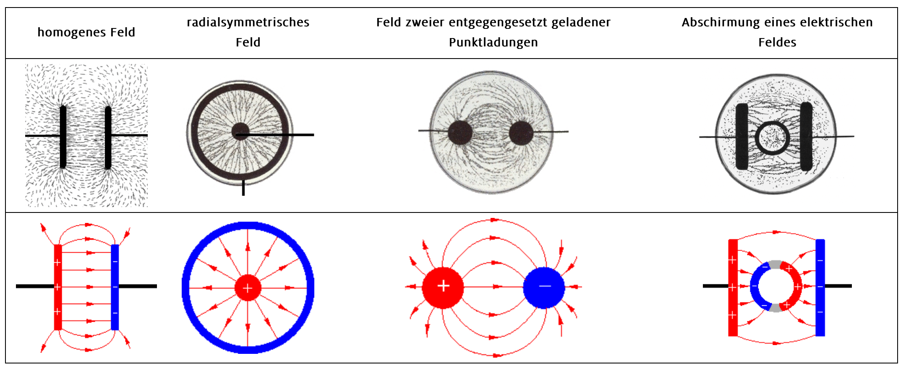

# COULOMB-Kraft

Die Kraft die von einem E-Feld auf eine Ladung ausgewirkt wird

## Kinetische Energie einer Ladung im elektrischen Feld ausrechnen

- kinetische Energie ($\frac{1}{2} m v^2$) gleich der Energie des elektrischen Feldes gleichsetzen
- Zu v umstellen

# Elektrische Feldstärke

## Flächenladungsdichte

TODO

## Definition der elektrischen Feldstärke

TODO

## Zusammenhang zwischen Spannung und elektrischer Feldstärke im Plattenkondensator

TODO

## elektrische Feldkonstante

TODO

$\epsilon_0$

# Felder

## Grundlegende Eigenschaften eines Feldes, Definition des Begriffs „Feld“

> Ein Feld ist die räumliche Verteilung einer physikalischen Größe.

- Wenn in einem Raum elektrische Kraftwirkungen auftreten, so herrscht in diesem Raum ein elektrisches Feld.
- Ein elektrisches Feld wird durch elektrische Ladungen erzeugt. Das Feld ist Vermittler für elektrische Kräfte.

## Feldlinienmodell

Das Feldlinienmodell ist eine Möglichkeit ein Feld zu visualisieren. Die Feldlinen veranschaulichen modellhaft die Struktur des E-Feldes. Je dichter die Feldlinien sind, desto stärker ist das E-Feld.

- Elektrisches Feld: Plus zu Minus
  - Elektrische Feldlinien zeigen immer in die Richtung der Kraft auf einen positiv geladenen Probekörper.
- Magnetisches Feld: Nord zu Süd TODO

### grundlegende elektrische und magnetische Feldlinienbilder

### Elektrisches Feld (Radialfeld)

- wirbelfreies Quellenfeld
- Plus -> Minus

### Elektrisches Feld (homogenes Feld)

- symmetrische Feldlinen zwischen zwei Platten
- Plus -> Minus

### Magnetisches Feld (Dipolfeld)

- quellenfreies Wirbelfeld
- Nord -> Süd (außen)
- Feldlinien sind geschlossen (Wirbel gehen in dem Magneten weiter)

## Superposition von Feldern, zeichnerische Addition zweier feldbeschreibender Vektoren in der Ebene

- Felder addieren sich nur (interagieren nicht)
- Um das entstehende Feld aus zwei anderen Feldern zu bekommen müssen alle jeweiligen Vektoren des Feldes miteinander addiert werden und das neue Feld entsteht

# Kondensator

## Aufbau

- Zwei Platten parallel zueinander
- Dielektrikum (Isolator / nicht Leitend) zwischen den Platten (bestimmt maßgeblich die Kapazität)
- Spannung zwischen den Platten

Es entsteht ein homogenes E-Feld zwischen den Platten.

## Definition der Kapazität

Die Kapazität ist das Speichervermögen eines Kondensators, also wie viele Ladungen gespeichert werden können.

- Wird in Farad angegeben
- Proportional zu dem Flächeninhalt, der Dielektrizitätszahl und umgekehrt zu dem Abstand der Platten

## Energie des elektrischen Feldes eines geladenen Kondensators (quantitativ)

TODO aufgaben angucken

- Kondensatoren sind in der Lage elektrische Energie zu speichern.
- Ist ein Kondensator der Kapazität $C$ mit einer Spannung $U$ aufgeladen und trägt die Ladung $Q$, dann gilt für die im Kondensator gespeicherte elektrische Energie $E_{el} = \frac{1}{2} Q U$
  - steht im Tafelwerk
- nur zum Verständnis, kann wenn nötig selber in der Klausur hergeleitet werden (Q und U in die vorherige Gleichung einsetzen): $E_{el} = \frac{1}{2} \cdot \epsilon_0 \cdot \epsilon_r \cdot E^2 \cdot V$

## Dielektrikum

- Isolator (nicht Leitend)

- die Elektronen der Atome werden durch das Feld zum plus-Pol gezogen
- Die Atome werden auf der Seite des Plus-Pols negativ geladen und auf der Seite des Minus-Pols positiv (Dipol) (Polarisierung
- Ein Gegenfeld zu dem E-Feld bildet sich
- Das E-Feld wird durch das Gegenfeld schwächer
- Die Kapazität wird erhöht

### Influenz

> Bei Leitern

- Die Elektronen in einem Leiter sind frei beweglich
- Durch ein E-Feld werden die Elektronen auf eine Seite des Leiters geschoben
- Ein Gegenfeld entsteht

### Polarisierung

> Bei Nicht-Leitern

- Die Elektronen im Atom werden durch ein E-Feld verschoben
- Die Atome werden Dipolar
- Sie erzeugen ein Gegenfeld entgegengesetzt zu dem Ausgangsfel

## Abhängigkeit der Kapazität von geometrischen Daten des Plattenkondensators sowie der Dielektrizitätszahl

$C = \epsilon_0 \cdot \epsilon_r \cdot \frac{A}{d}$

- $C \sim \epsilon_r$
- $C \sim A$
- $C \sim \frac{1}{d}$

## zeitlicher Verlauf der Stromstärke beim Aufladevorgang

TODO (qualitativ)

### Widerstand und Kapazität

TODO

## zeitlicher Verlauf der Stromstärke beim Entladungsvorgang

TODO (quantitativ)

> exponentielle Senkung der Spannung, Stromstärke und Ladung

- Die abgeflossene Ladung kann anhand der Entladungskurve der Stromstärke über das Integral bestimmt werden
- Entladungskurve der Stromstärke ist I abhängig von t
- $Q = I \cdot t$
- Höherer Widerstand => langsamere Entladung
- Höhere Kapazität => höherer Startpunkt der Entladungskurve

### Schaltplan und Messung der Entladungskurve

- Spannungsmessgeräte parallel schalten
- Stromstärke-Messgeräte in Reihe

- Spannungsquelle angeschlossen zum Aufladen
- Spannungsquelle wird getrennt
- Ein Widerstand ist angeschlossen, damit es einen Verbraucher gibt, der den Stromkreis schließt
- Über die Messgeräte kann die Entladungskurve gemessen werden

# Magnetische Flussdichte

## Definition der magnetischen Flussdichte

TODO

## Magnetfeld einer stromdurchflossenen Spule

TODO

### Einfluss (qualitativ) von Stromstärke, Windungszahl, Spulenlänge, Medium im Inneren

TODO
# Induktion durch Änderung des magnetischen Flusses

## Definition des magnetischen Flusses

TODO

## Induktionsgesetz unter Verwendung der mittleren Änderungsrate des magnetischen Flusses (Differenzenquotient)

TODO

## Anwendung des Induktionsgesetzes in den Spezialfällen konstanter Fläche und konstanter magnetischer Flussdichte

TODO

## Zusammenhang zwischen der Richtung des Induktionsstroms und seiner Wirkung

TODO# Energiebetrachtungen von Körpern in homogenen elektrischen Feldern

## potentielle Energie einer Probeladung im homogenen elektrischen Feld

TODO

## kinetische Energie und Geschwindigkeit geladener Teilchen im elektrischen Längsfeld in Abhängigkeit von der Beschleunigungsspannung (quantitativ)

TODO

## Elektronenvolt (eV) als Einheit

TODO
# Kräfte auf Körper in homogenen elektrischen und magnetischen Feldern, Bahnformen (qualitativ)

## Kraft auf geladene Teilchen bei gegebener elektrischer Feldstärke

TODO

## Bahnformen geladener Teilchen im homogenen elektrischen Längs- und Querfeld (qualitativ)

TODO

## Lorentzkraft auf geladene Teilchen bei gegebener magnetischer Flussdichte

TODO

## Bahnformen geladener Teilchen im homogenen magnetischen Feld (qualitativ), Lorentzkraft als Radialkraft (qualitativ)

TODO

## Richtung und Betrag der Lorentzkraft für den orthogonalen Fall

TODO
