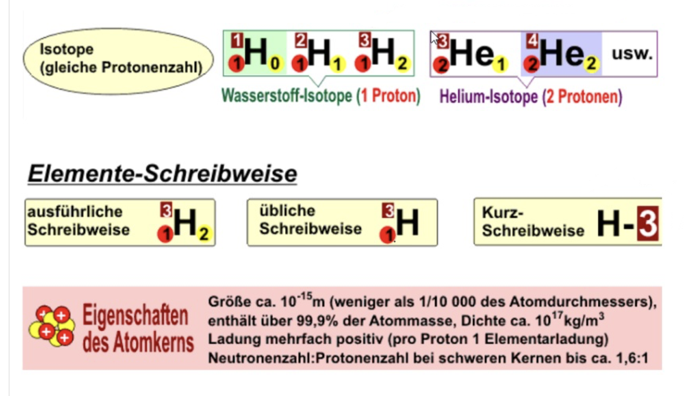
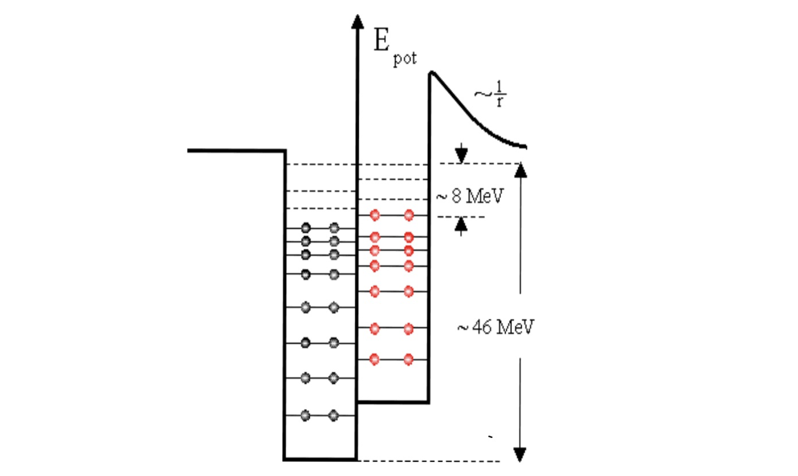

# Der Atomkern

## Rutherford / Bohr

- Alle Atome bestehen aus Neutronen, Protonen (Kern) und Elektronen (Atomhülle).
- Die Masse befindet sich im Kern.
- Neutron leicht schwerer als Proton.

## Elemente und Isotope

- Neutronen und Protonen sind Nukleonen.
- Jedes chemisches Element hat eine feste Protonenzahl Z, kann aber mehrere Isotope mit unterschiedlicher Anzahl an Neutronen besitzen.
- Die Nukleonenzahl ist die Summe der Protonen und Neutronen.

## Kräfte im Kern

### COULOMB-Kraft

- Gleiche Ladungen stoßen sich ab.
- Protonen stoßen sich gegenseitig ab.
- Der Atomkern sollte auseinanderfliegen.

### starke Wechselwirkung

Grund dafür, dass der Atomkern nicht auseinanderfällt.

- Ladungsunabhängig
- Kurze Distanz
- stoßt ab (geringe Distanz) und zieht an (höhere Distanz)
- bei zunehmender Protonenzahl müssen mehr Neutronen sich im Kern befinden, um die kurze Distanz der starken Wechselwirkung auszugleichen, so dass die COULOMB-Kraft ausgeglichen wird

## Potentialtopf im Kern

- Die Nukleonen im Kern sind Quantenobjekte.
- Die Protonen und Neutronen haben ihren jeweiligen Potentialtopf mit unterschiedlichen diskreten Energieniveaus wie bei der Atomhülle
- Die Energie im Kern ist um das millionenfache größer als in der Hülle

# Nachweisgeräte für radioaktive Strahlung

## Was ist radioaktive bzw. ionisierende Strahlung?

Strahlung, die Elektronen aus einem Atom lösen kann.

## Geiger-Müller-Zählrohr

TODO (Studyflix Video)

- ein robustes Nachweisgerät für ionisierende Strahlung
- besonders gut für den Nachweis von Alpha- und Betastrahlung, Gammastrahlung kann nur zu einem kleinen Teil registriert werden
- meist an einen Digitalzähler oder einen Lautsprecher angeschlossen

### Aufbau

- Metallzylinder (negativ geladen / Kathode)
- Glimmerfenster (hält das Gas drinnen und lässt Strahlung durch)
- sehr dünner Zähldraht (positiv geladen / Anode)
- Innenraum: Füllgas (Edelgas: kaum reagent) und geringer Druck (verhindern von Ionisierung durch das Gas); elektrisches Feld zwischen Zähldraht und Metallzylinder

### Funktionsweise

1. ionisierende Strahlung trifft auf ein Atom des Gases
2. ein Elektron wird gelöst
3. das Elektron geht in Richtung des Zähldrahts, ionisiertes Atom geht in Richtung Metallzylinder
4. wegen sehr hoher Spannung kriegen die Elektronen sehr schnell viel Bewegungsenergie
5. die Elektronen ionisieren weitere Atome und lösen Elektronen => Elektronenkaskade
6. es bildet sich ein Kanal zwischen dem Zylinder und Draht aus freien Ladungsträgern
7. der Stromkreis zwischen der Kathode und Anode wird geschlossen
8. die Stromstärke kann gemessen werden
9. Ausgabe über Digitalzähler oder Lautsprecher

### Limitationen

- kann nicht zwischen Strahlung unterscheiden
- Todzeit zwischen den Messungen
 - ist ein Kanal erstmal erstellt führt eine weitere Ionisierung zu keinem Unterscheid
 - erst wenn der Kanal wieder zusammenbricht kann neue Strahlung wahrgenommen werden

### Vorteile Geiger-Müller-Zähler

- Mobil / Transport
- Empfindlich
- Universell (alpha / beta Strahlung) gemessen
- Kostengünstig

## Nebelkammer

- Was für Strahlung anhand von Energie / Länge der Spuren
- Unterschied zwischen Alpha und Beta anhand von E-Feld oder B-Feld, die die Teilchen wegen unterschiedlicher Ladung unterschiedlich ablenken

- staubfreie Kammer
- Elektrisches Feld zwischen Deckel und Boden entfernt alle vorhandenen Ionen
- Luft mit Wasser- und Alkoholdampf gesättigt in der Kammer
- Druck wird gesenkt
  - Dampf müsste kondensieren, da die Aufnahmefähigkeit der Luft für Wasser mit dem Druck sinkt
- Kleine, rasch durchgeführte Drucksenkung führt wegen fehlender Keime nicht gleich zur Kondensation, sondern zu einem übersättigten Dampf
- Ionen, die durch ionisierende Strahlung entstehenden bilden kleine Nebeltröpfchen
- Es entstehen Spuren mit gleicher Tropfendichte.
- Ionisierende Strahlung erzeugt auf Strecken Ionen
- Die Bildung von Ionen erfordert eine bestimmte Energie
  - Die Länge der Strahlen zeigt die Energie der Strahlung

## Szintillationszähler

- Misst nur Gammastrahlen, da Alpha- und Betastrahlung abgeschirmt wird (kollidieren mit ersten Atomen und dann vorbei)
  - Dringt nicht ins innere des Kristalls ein.
- Anzahl der Elektronen

- Gamma-Strahlung trifft auf Kristall
  - Löst Elektronen
  - Elektronen treffen auf Atome
  - Energieniveau der Atome steigt
  - Fällt wieder
  - Gibt licht ab
- Wird verstärkt und gebündelt
- Wird gemessen von einer Fotokathode

## Halbleiterdetektoren

- Messung der Energie, da Energie proportional zur gemessenen Spannung
- Art der Strahlung aus Energieniveau
- Sehr empfindlich

- Diode wird in Sperrrichtung geschaltet
- Gelegentliche Spannungsimpulse, da einzelne Atome ionisiert werden und Elektronen frei werden

# Zerfall

## Zerfallsgesetze

Bestimmte Nuklide Zerfallen von selbst und senden Strahlung aus

Radioaktive Kerne zerfallen bei zu großer Masse, bei ungünstigen Verhältnis zwischen Neutronen und Protonen bis ein stabiler Zustand erreicht ist.

- Es handelt sich um exponentiellen Zerfall: $N(t) = N_0 \cdot e^{-\lambda t}$
- Die momentane Änderungsrate des Bestandes ist proportional zum Bestand.
  - $N'(t) = -\lambda \cdot N(t)$
  - $\lambda$ ist die Zerfallskonstante.
- Die Halbwertszeit ist die Zeit, die der Bestand oder die Aktivität benötigt um sich zu halbieren.

### Aktivität

- Die Aktivität eines radioaktiven Präparates ist das Maß für die Anzahl der momentan in dem Präparat stattfindenden radioaktiven Zerfälle.
- Die Art der Zerfälle ist irrelevant.
- Kann u. a. mit dem Geiger-Müller-Zählrohr gemessen werden.
- Wird in Becquerel gemessen ($1 Bq := \frac{1}{s}$).
- Für die Aktivität $A$ zum Zeitpunkt $t$ gilt $A(t) = A_0 \cdot e^{-\lambda t} = \lambda \cdot N_0 \cdot e^{- \lambda t}$.

## Zerfallsreihen

- Es gibt nur 4 natürliche Zerfallsreihen, auf denen jedes Isotop liegt
  - liegt an dem Alpha-Zerfall, mit ihren -2 Neutronen / -2 Protonen schritten
  - Die Plutonium-Neptunium-Reihe ist künstlich, da kein Plutonium mehr existiert und erzeugt werden muss

## Alpha-Zerfall

- Alpha-Strahlung besteht aus einem Heliumkern (2 Proton, 2 Neutron)
- Doppelt positiv geladen
  - Lassen sich von E-Feldern und B-Feldern ablenken
- Sehr energiereich, hohes Ionisierungsvermögen (ionisiert viele Teilchen in kleinem Raum)
- auch Gammastrahlung entsteht
- Sehr Leicht abschirmbar (sehr geringe Reichweite), da die Strahlung mit den Atomen koalliediert.
  - Die Haut kann die meiste Alpha-Strahlung abschirmen.
  - wenn eingeatmet (siehe Tschernobyl eingeatmeter Feinstaub) sehr gefährlich

### Entstehung

- Protonen und Neutronen sind Quantenobjekte
- Einzelne Nukleonen haben eine hundertprozentige Wahrscheinlichkeit im Kern zu sein.
- Tunneleffekt: Zwei Protonen und zwei Neutronen haben unter den richtigen Bedingungen (u. a. ungünstiges Verhältnis von Neutronen / Elektronen, große Masse) eine sehr geringe Wahrscheinlichkeit außerhalb des Kerns zu sein

## Beta-Minus-Zerfall

- Teilchenstrahlung aus Elektronen
- Kontinuierliches Spektrum
- Weniger energiereich als Alpha-Strahlung (mittleres Ionisierungsvermögen)
  - Beta-Minus-Teilchen können unterschiedliche große Energie haben
- Negativ geladen
  - E-Felder und B-Felder beeinflussen
- Neutron wandelt sich in ein Proton um
  - Dabei entsteht ein Elektron und ein Neutrino, die den Kern verlassen
- - Siehe Problem und Lösung
- Auch leicht abschirmbar (geringe Reichweite)

### Problem

- kontinuierliches Spektrum, obwohl Gammastrahlung diskret und deswegen Beta eigentlich auch diskret seien müssen, weil auch Gamma entsteht
  - Energieerhaltungssatz verletzt (Energie geht weg)
- Neutron (spin: 1/2) wird zu Proton (spin: 1/2) und Elektron (Spin: -1/2)
  - Der Spin des Elektrons nicht erklärbar
  - Drehimpuls (Spin) verletzt -> Impulserhaltungssatz verletzt

### Lösung

- ein Neutrino entsteht
  - Keine Ladung
    - Keine elektromagnetische Wechselwirkung
  - Hat restliche Energie (jedes Mal unterschiedlich wie viel => kontinuierliches Spektrum bei den Elektronen)
  - Hat Spin (1/2)
  - Kaum Masse
    - Breiten sich mit fast Lichtgeschwindigkeit aus
  - Unterliegt nicht der Kernkraft
    - Extrem großes Durchdringungsvermögen

### Nachweis

- wurden nachgewiesen in Kernreaktor
- Kernumwandlung wenn Neutrinos auf Gallium treffen als Nachweis

### Beta-Plus-Zerfall

- Wie der Beta-Minus-Zerfall, nur dass ein Proton zu einem Neutron wird und ein Positron abgegeben wird

## Gamma-Zerfall

- Diskrete Strahlung (Licht)
- Das diskrete Energieniveau der Nukleonen im Kerns fällt und es entsteht Gamma-Strahlung (wie bei der Schale, nur energiereicher).
  - Da sich die Nukleonen im Kern wieder neu anordnen müssen entsteht bei jedem Zerfall auch Gamma-Strahlung.
