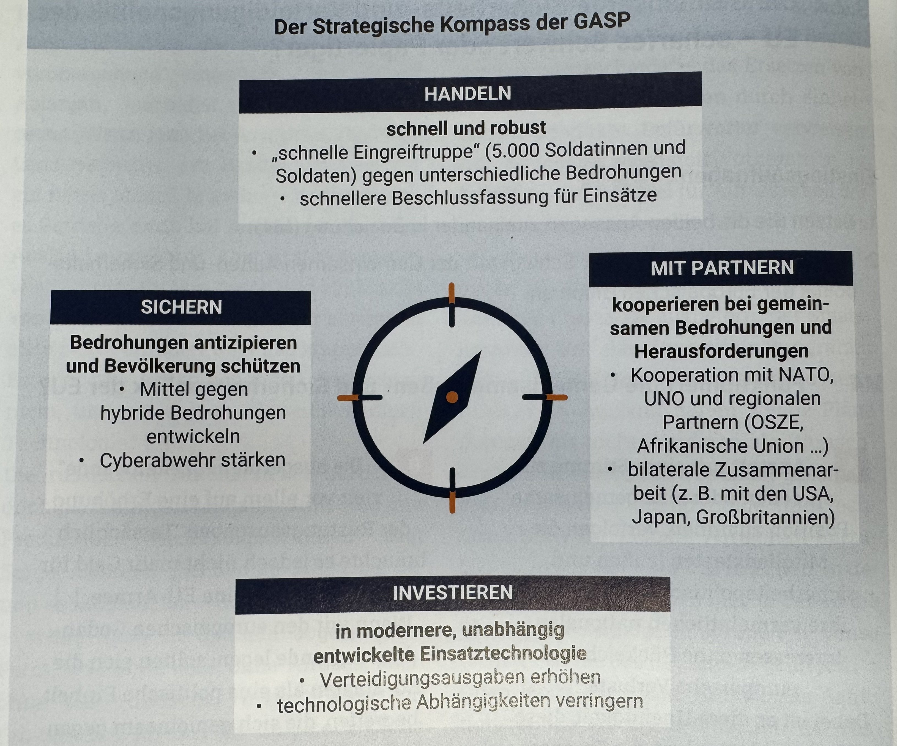

# Außen- und Sicherheitspolitik Deutschlands als Teil internationaler Bündnisse zur Friedenssicherung und Systeme kollektiver Sicherheit (u. a. NATO, EU)

## NATO

### Gründung

- 1949 Gegründet
  - Schutz vor Ausbreitung Russlands
  - „Keep the Russians out“
  - „Keep the Americans in“
  - „Keep the Germans down“
- Entgegengesetzt zu dem Warschauer Pakt
  Ziele
- Soll die Länder in Europa und Nordamerika schützen
- Werte-, Politikgemeinschaft

### Mittel

- Anfangs Drohung mit Atomwaffen gegen jeden Angriff
- Später flexiblere Antwort auf Konflikte
  o Atomwaffen nur als letztes Mittel
  NATO-Ost-Erweiterung
- Warschauer Pakt geht zugrunde, wegen fehlender Finanzierung / schlechter Wirtschaft im Osten
- Staaten im Osten wollen ihre Unabhängigkeit von Russland durch einen NATO-Beitritt sichern
- Russland sieht die NATO-Ost-Erweiterung als Provokation

## EU

### Geschichte

- Vertrag von Maastricht: Gemeinsame Sicherheits- und Außenpolitik
- Vertrag von Amsterdam: Ausbau der GASP
- Vertrag von Lissabon: Stärkung der GASP

### GASP (Gemeinsame Außen- und Sicherheitspolitik)

### Mittel

#### Diplomatische Instrumente

- Erklärungen zu internationalen Entwicklungen
- Hilfsangebote
- Sanktionsmaßnahmen
- Beteiligung an multinationalen Verhandlungen
- gemeinsame Stimmabnahmen (UN-Generalversammlung)
- Militärische Operation
  - größtenteils durch die NATO

#### Herausforderungen

- Terrorismus
- Energieversorgungssicherheit
- große Mitgliedsstaaten unterlaufen die GASP
  - z. B. Deutschland und Frankreich nach Annexion der Krim Minsker Friedensplan
- Handlungsfähigkeit der EU eingeschränkt
  - viele nationale Interessen
