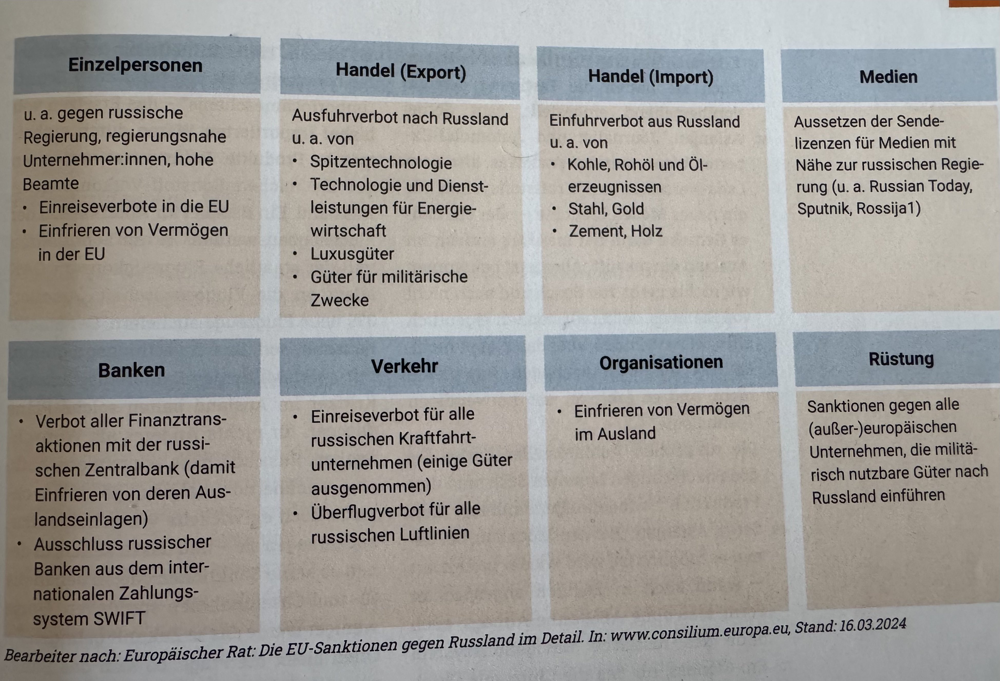

# Sanktionen gegen Russland von der EU

## Folgen und Probleme mit den Sanktionen gegen Russland

- Sanktionen im Finanzsektor führen zu weniger Zugang zu Geld im Ausland
  - russische Firmen haben gleiches Problem
- Imageschaden für Russland
- Handelssanktionen wirken eher mittel- bis langfristig wirklich
  - Beispiel: viele russische Automobilhersteller mussten Werke schließen, weil Teile fehlen oder sie haben keinen Zugang zu neuester Technologie
- Auswirkungen teilweise schwer zu greifen und doch da
- langfristig glauben ausländische Beobachter an schwere Schäden für die russische Wirtschaft
- unwahrscheinlich, dass Russland aufgrund von Sanktionen seinen Krieg beendet.
